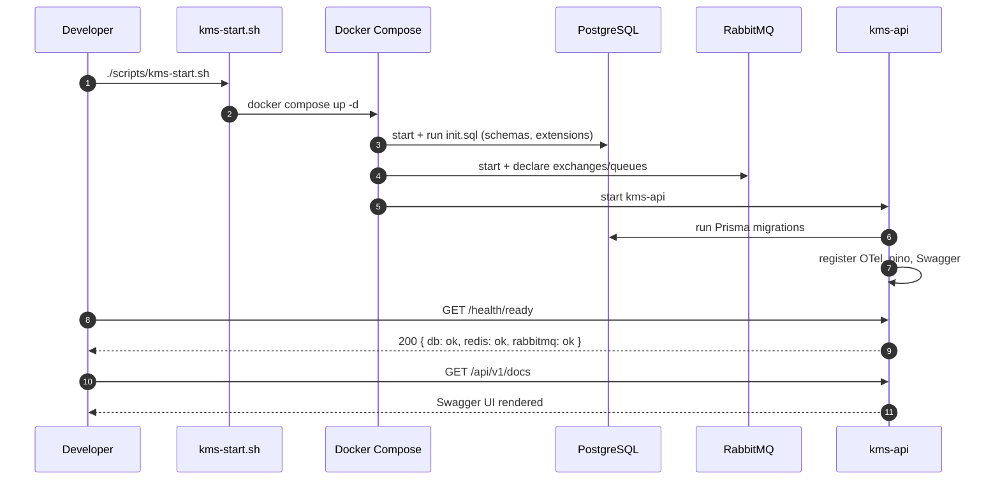

# PRD: M00 — Project Setup & Boilerplate

## Status

`Approved`

**Created**: 2026-03-17
**Priority**: P0 — Must complete before any other module

---

## Business Context

Without a solid monorepo foundation, every subsequent feature will be built on shifting sand. The boilerplate gates ensure: any developer can `git clone` and be running in under 10 minutes; every service has consistent structured logging, OTel tracing, error handling, and health checks from day 1; CI/CD catches regressions automatically. Getting these right once saves weeks of rework across 13 modules.

---

## User Stories

| As a... | I want to... | So that... |
|---------|-------------|-----------|
| Developer | Run `./scripts/kms-start.sh` and see all services healthy | I can start feature work immediately |
| Developer | See structured JSON logs in every service | I can debug issues without console.log |
| Developer | See traces in Jaeger for every request | I can understand cross-service flows |
| Developer | Push code and see CI pass automatically | I know my change doesn't break others |
| Team lead | Check `GET /health/ready` on any service | I know its dependency status instantly |

---

## Scope

**In scope:**
- All 8 service skeletons with consistent structure
- Docker Compose with health checks for all 20 containers
- OTel pipeline (collector → Jaeger + Prometheus + Grafana)
- CI/CD GitHub Actions (lint + test + Docker build)
- Prisma schema with all domain tables + initial migration
- RabbitMQ topology (exchanges, queues, DLX, quorum)
- Qdrant collection + Neo4j constraints
- Frontend Next.js 15 shell with design tokens and routing

**Out of scope:**
- Any feature-specific business logic
- Google Drive OAuth
- BGE-M3 model download (deferred to M04)

---

## Functional Requirements

| ID | Requirement | Priority |
|----|-------------|----------|
| FR-01 | `./scripts/kms-start.sh` starts all services; all `/health/ready` return 200 within 60s | Must |
| FR-02 | Every NestJS service: Fastify, SWC, pino logger, OTel, Swagger, ZodValidation, error filters | Must |
| FR-03 | Every Python service: structlog, OTel, pydantic-settings, health endpoints | Must |
| FR-04 | Prisma schema covers all 3 domains (auth, kms, voice) with initial migration | Must |
| FR-05 | RabbitMQ: all queues declared with DLX, quorum type, TTL policies | Must |
| FR-06 | Qdrant: `kms_chunks` collection created (1024-dim, INT8 quantized) | Must |
| FR-07 | Neo4j: node constraints and indexes created | Must |
| FR-08 | OTel traces visible in Jaeger; metrics in Prometheus; dashboards in Grafana | Must |
| FR-09 | CI: lint + test run on every PR; fail = block merge | Must |
| FR-10 | Frontend: Next.js 15 App Router + design token system + base layout renders | Must |
| FR-11 | `npm run test` (NestJS) and `pytest` (Python) run and pass sample specs | Must |

---

## Non-Functional Requirements

| Concern | Requirement |
|---------|-------------|
| Cold start | `kms-start.sh` → all services healthy in < 90 seconds |
| CI speed | Full lint + test pipeline completes in < 5 minutes |
| Log format | JSON with mandatory fields: timestamp, level, service, trace_id, span_id, request_id |
| Image size | Production Docker images < 500MB per service |
| Coverage gate | Sample specs must pass; coverage target set (80%) |

---

## Service Structure Standards

### NestJS service `src/` layout
```
src/
├── instrumentation.ts          # OTel init — line 1 of main.ts import
├── main.ts                     # Bootstrap: Fastify, Logger, Swagger, prefix
├── app.module.ts               # Root: ConfigModule, LoggerModule, ThrottlerModule
├── config/config.schema.ts     # Zod env validation
├── common/
│   ├── filters/                # AllExceptionsFilter, PrismaExceptionFilter
│   ├── guards/                 # JwtAuthGuard, RolesGuard (skeleton)
│   ├── interceptors/           # LoggingInterceptor
│   ├── middleware/             # RequestIdMiddleware
│   └── pipes/                  # ZodValidationPipe
├── health/                     # HealthModule: /health/live, /health/ready, /health/startup
└── prisma/                     # PrismaModule, PrismaService (kms-api only)
```

### Python service layout
```
src/
├── config.py                   # pydantic-settings BaseSettings
├── main.py                     # FastAPI app + lifespan (OTel + structlog first)
├── worker.py                   # aio-pika consumer entrypoint (workers only)
├── observability.py            # configure_telemetry(app)
├── exceptions/                 # KMSWorkerError subclass hierarchy
└── health/                     # /health/live, /health/ready handlers
```

---

## Docker Compose Service Map

| Service | Image | Port | Health Check |
|---------|-------|------|-------------|
| kms-api | `./kms-api` | 8000 | `GET /health/ready` |
| search-api | `./search-api` | 8001 | `GET /health/ready` |
| rag-service | `./services/rag-service` | 8002 | `GET /health/ready` |
| voice-app | `./services/voice-app` | 8003 | `GET /health/ready` |
| scan-worker | `./services/scan-worker` | 8010 | `GET /health/live` |
| embed-worker | `./services/embed-worker` | 8011 | `GET /health/live` |
| dedup-worker | `./services/dedup-worker` | 8012 | `GET /health/live` |
| graph-worker | `./services/graph-worker` | 8013 | `GET /health/live` |
| postgres | `postgres:16` | 5432 | `pg_isready` |
| qdrant | `qdrant/qdrant` | 6333 | `GET /readyz` |
| neo4j | `neo4j:5` | 7474/7687 | `cypher-shell` |
| redis | `redis:7` | 6379 | `redis-cli ping` |
| rabbitmq | `rabbitmq:3.13-management` | 5672/15672 | management API |
| minio | `minio/minio` | 9000/9001 | `mc ready` |
| otel-collector | `otel/opentelemetry-collector` | 4317/4318 | — |
| jaeger | `jaegertracing/all-in-one` | 16686 | — |
| prometheus | `prom/prometheus` | 9090 | — |
| grafana | `grafana/grafana` | 3100 | — |
| frontend | `./frontend` | 3000 | `GET /` |
| nginx | `nginx:alpine` | 80/443 | — |

---

## Flow Diagram



---

## Decisions Required

All decisions resolved — see ADRs:

| Decision | ADR |
|---------|-----|
| NestJS HTTP adapter | [ADR-0001](../architecture/decisions/0001-fastify-over-express.md) |
| NestJS ORM | [ADR-0002](../architecture/decisions/0002-prisma-over-typeorm.md) |
| NestJS logging | [ADR-0003](../architecture/decisions/0003-nestjs-pino-logging.md) |
| NestJS compiler | [ADR-0004](../architecture/decisions/0004-swc-compiler.md) |
| Python logging | [ADR-0007](../architecture/decisions/0007-structlog-over-loguru.md) |
| Python AMQP | [ADR-0006](../architecture/decisions/0006-aio-pika-over-celery.md) |

---

## Testing Plan

| Test Type | Scope | Notes |
|-----------|-------|-------|
| Unit | `HealthController`, `AppModule` wiring | All services |
| Integration | DB connection, Redis ping, RabbitMQ channel open | kms-api only for boilerplate |
| Docker | `docker compose up` → all health checks pass | CI smoke test |

---

## Rollout

| Item | Value |
|------|-------|
| Feature flag | N/A — boilerplate is always on |
| Requires migration | Yes — `001_initial_schema` |
| Blocking | All other modules depend on this |
| Estimated effort | 5–7 days (1 developer) |
