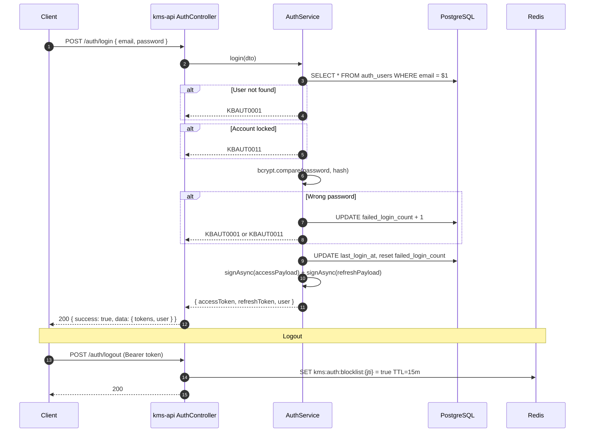

# PRD: M01 — Authentication & User Management

## Status

`Approved`

**Created**: 2026-03-17
**Depends on**: M00 (project setup)

---

## Business Context

KMS is a personal + team knowledge workspace. Authentication must be secure but frictionless. Users register with email/password and receive JWT tokens for browser access. Programmatic clients (scripts, integrations) use long-lived API keys. RBAC ensures admin functions (user management, system config) are protected. Account lockout prevents brute-force attacks.

---

## User Stories

| As a... | I want to... | So that... |
|---------|-------------|-----------|
| New user | Register with email and password | I can create my KMS workspace |
| User | Login and get a JWT token | I can access my files |
| User | Refresh my token silently | My session doesn't expire mid-work |
| User | Create an API key | I can integrate KMS with scripts |
| User | Revoke an API key | I can remove access if a key is compromised |
| Admin | List all users | I can manage who has access |
| Admin | Deactivate a user account | I can remove access without deleting data |

---

## Scope

**In scope:**
- Email/password registration + login
- JWT access token (15m) + refresh token (7d)
- API key creation, listing, revocation
- RBAC: `ADMIN`, `USER` roles
- Account lockout: 5 failures → 30min lock
- `@Public()` decorator for open routes
- `@Roles()` decorator for role-protected routes

**Out of scope:**
- Google OAuth (deferred to M02 for Google Drive)
- Email verification (stub endpoint, no email sending yet)
- Password reset via email (stub only)
- SSO / SAML (post-MVP)

---

## Functional Requirements

| ID | Requirement | Priority |
|----|-------------|----------|
| FR-01 | `POST /api/v1/auth/register` — email + password, return user (no tokens) | Must |
| FR-02 | `POST /api/v1/auth/login` — validate credentials, return `{ accessToken, refreshToken, user }` | Must |
| FR-03 | `POST /api/v1/auth/refresh` — validate refresh token, return new token pair | Must |
| FR-04 | `POST /api/v1/auth/logout` — invalidate refresh token (Redis blocklist) | Must |
| FR-05 | `POST /api/v1/auth/change-password` — verify current, hash new, update | Must |
| FR-06 | `GET /api/v1/users/me` — return authenticated user profile | Must |
| FR-07 | `POST /api/v1/api-keys` — create named API key, return plaintext once | Must |
| FR-08 | `GET /api/v1/api-keys` — list user's keys (hash only, never plaintext) | Must |
| FR-09 | `DELETE /api/v1/api-keys/{id}` — revoke key | Must |
| FR-10 | `GET /api/v1/users` — list all users (ADMIN only) | Must |
| FR-11 | `PATCH /api/v1/users/{id}/status` — activate/deactivate (ADMIN only) | Must |
| FR-12 | Account lockout: 5 consecutive failures → lock 30 min | Must |
| FR-13 | Generic error on failed login — do not reveal if email exists | Must |

---

## Non-Functional Requirements

| Concern | Requirement |
|---------|-------------|
| Password hashing | bcrypt with 12 rounds |
| API key format | `kms_` prefix + 32 random chars (urlsafe base64) |
| API key storage | SHA-256 hash stored; plaintext never persisted |
| Token expiry | Access: 15m, Refresh: 7d |
| Lockout | 5 failures → locked_until = now + 30min |
| Rate limit | Auth routes: 10 req/min per IP |

---

## Error Codes

| Code | HTTP | Description |
|------|------|-------------|
| `KBAUT0001` | 401 | Invalid email or password |
| `KBAUT0002` | 401 | Access token expired |
| `KBAUT0003` | 401 | Invalid access token |
| `KBAUT0005` | 401 | Refresh token expired |
| `KBAUT0006` | 401 | Invalid refresh token |
| `KBAUT0007` | 401 | Invalid or missing API key |
| `KBAUT0008` | 401 | API key expired |
| `KBAUT0009` | 401 | API key revoked |
| `KBAUT0011` | 403 | Account locked |
| `KBAUT0012` | 403 | Email not verified (stub) |
| `KBAUT0013` | 403 | Account deactivated |
| `KBAUZ0001` | 403 | Insufficient role |
| `KBGEN0002` | 409 | Email already registered |

---

## Flow Diagram



---

## Code Structure

| File | Responsibility |
|------|---------------|
| `src/modules/auth/auth.module.ts` | Module: wires AuthService, strategies, guards |
| `src/modules/auth/auth.controller.ts` | Endpoints: register, login, refresh, logout, change-password |
| `src/modules/auth/auth.service.ts` | Business logic: credential check, token gen, lockout |
| `src/modules/auth/dto/auth.dto.ts` | Zod + Swagger DTOs for all auth endpoints |
| `src/modules/auth/strategies/jwt.strategy.ts` | Passport JWT: extract Bearer, validate payload |
| `src/modules/auth/strategies/api-key.strategy.ts` | Passport custom: read X-API-Key, SHA-256, DB lookup |
| `src/modules/auth/guards/combined-auth.guard.ts` | Auto-detect JWT vs API key |
| `src/modules/users/users.module.ts` | User management module |
| `src/modules/users/users.controller.ts` | GET /users, PATCH /users/{id}/status |
| `src/modules/api-keys/api-keys.module.ts` | API key management module |
| `src/common/guards/roles.guard.ts` | RBAC: check @Roles() against user.role |
| `src/common/decorators/public.decorator.ts` | @Public() — skip auth on route |
| `src/common/decorators/roles.decorator.ts` | @Roles(UserRole.ADMIN) |

---

## DB Schema

```sql
CREATE TABLE auth_users (
    id UUID PRIMARY KEY DEFAULT gen_random_uuid(),
    email VARCHAR(255) UNIQUE NOT NULL,
    password_hash VARCHAR(255) NOT NULL,
    role VARCHAR(20) NOT NULL DEFAULT 'USER', -- USER | ADMIN
    status VARCHAR(20) NOT NULL DEFAULT 'ACTIVE', -- ACTIVE | INACTIVE | PENDING_VERIFICATION
    failed_login_count INT DEFAULT 0,
    locked_until TIMESTAMPTZ,
    last_login_at TIMESTAMPTZ,
    created_at TIMESTAMPTZ DEFAULT NOW(),
    updated_at TIMESTAMPTZ DEFAULT NOW()
);

CREATE TABLE auth_api_keys (
    id UUID PRIMARY KEY DEFAULT gen_random_uuid(),
    user_id UUID NOT NULL REFERENCES auth_users(id) ON DELETE CASCADE,
    name VARCHAR(100) NOT NULL,
    key_hash CHAR(64) NOT NULL UNIQUE, -- SHA-256 hex
    key_prefix CHAR(12) NOT NULL, -- first 12 chars for display
    expires_at TIMESTAMPTZ,
    revoked_at TIMESTAMPTZ,
    last_used_at TIMESTAMPTZ,
    created_at TIMESTAMPTZ DEFAULT NOW()
);
```

---

## Redis Keys

| Key | Value | TTL |
|-----|-------|-----|
| `kms:auth:blocklist:{jti}` | `1` | Match token expiry (15m) |
| `kms:auth:ratelimit:{ip}` | Request count | 15 minutes |
| `kms:auth:user:{userId}` | Serialized user (cache) | 5 minutes |

---

## Testing Plan

| Test Type | Scope | Key Cases |
|-----------|-------|-----------|
| Unit | `AuthService` | Correct lockout increment, token generation, bcrypt compare |
| Unit | `CombinedAuthGuard` | API key header detection, JWT fallback |
| E2E | Auth endpoints | Register → login → refresh → logout → login-again-fails |
| E2E | Lockout | 5 bad passwords → locked → wait → unlocked |
| E2E | API key | Create → use in X-API-Key header → revoke → rejected |

---

## ADR Links

- [ADR-0001](../architecture/decisions/0001-fastify-over-express.md)
- [ADR-0002](../architecture/decisions/0002-prisma-over-typeorm.md)
- [ADR-0003](../architecture/decisions/0003-nestjs-pino-logging.md)
