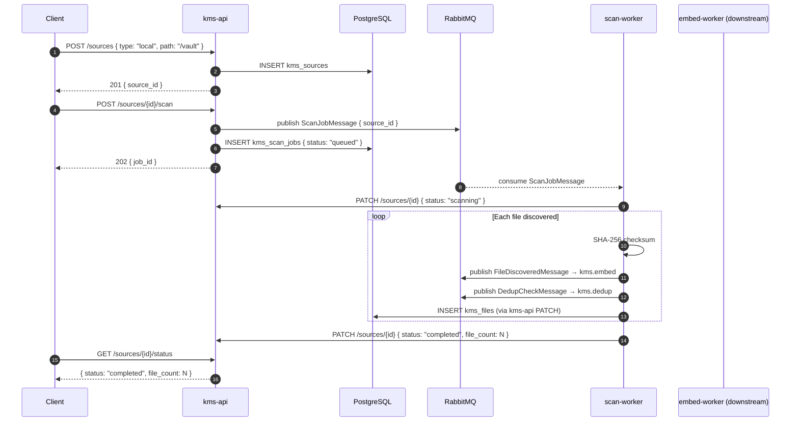

# PRD: M02 — Source Integration

## Status

`Approved`

**Created**: 2026-03-17
**Depends on**: M00, M01

---

## Business Context

KMS is only as useful as the files it knows about. Source integration is the ingestion gateway: users connect file sources (local folder, Google Drive) and KMS automatically discovers all files, extracts metadata, and queues them for content processing. Delta sync ensures re-scans only process changed files. Without this module, there is nothing to search, embed, or deduplicate.

---

## User Stories

| As a... | I want to... | So that... |
|---------|-------------|-----------|
| User | Connect a local folder | KMS indexes all my files automatically |
| User | Connect Google Drive | KMS indexes my cloud files too |
| User | Trigger a re-scan | KMS picks up newly added files |
| User | See scan progress | I know how many files have been discovered |
| User | Disconnect a source | KMS stops indexing it and removes its files |

---

## Scope

**In scope:**
- Source types: `local`, `google_drive`
- Full scan (first connect) + delta scan (re-scan with change tracking)
- File metadata extraction: name, path, size, MIME type, created/modified dates
- SHA-256 checksum per file
- Publish `FileDiscoveredMessage` to `kms.embed` and `DedupCheckMessage` to `kms.dedup`
- Google Drive OAuth 2.0 flow (redirect → callback → token storage)
- Scan progress tracking (live status via polling endpoint)

**Out of scope:**
- Obsidian vault sync (M12)
- Notion/GitHub connectors (post-MVP)
- Real-time file watching (MVP uses manual scan trigger)
- Automatic scheduled scans (post-MVP, cron-based)

---

## Functional Requirements

| ID | Requirement | Priority |
|----|-------------|----------|
| FR-01 | `POST /api/v1/sources` — create source (type, name, config) | Must |
| FR-02 | `GET /api/v1/sources` — list user's sources with status | Must |
| FR-03 | `DELETE /api/v1/sources/{id}` — remove source + all its files | Must |
| FR-04 | `POST /api/v1/sources/{id}/scan` — trigger a scan job | Must |
| FR-05 | `GET /api/v1/sources/{id}/status` — poll scan progress | Must |
| FR-06 | `GET /api/v1/sources/{id}/scan-history` — past scan jobs | Should |
| FR-07 | `GET /api/v1/auth/google` — initiate Drive OAuth | Must |
| FR-08 | `GET /api/v1/auth/google/callback` — handle OAuth callback, store tokens | Must |
| FR-09 | scan-worker: LocalFileConnector — recursive walk, SHA-256, MIME detection | Must |
| FR-10 | scan-worker: GoogleDriveConnector — Drive API v3 list, delta with pageToken | Must |
| FR-11 | scan-worker: publish `FileDiscoveredMessage` to `kms.embed` per file | Must |
| FR-12 | scan-worker: PATCH source status start/complete/error via kms-api | Must |
| FR-13 | Google Drive: exponential backoff on 429 rate limits | Must |
| FR-14 | Local scan: skip hidden files (`.git/`, `.DS_Store`, `node_modules/`) by default | Must |

---

## Non-Functional Requirements

| Concern | Requirement |
|---------|-------------|
| Throughput | Local scan: ≥ 1000 files/min |
| Google Drive | Handle 10k+ file Drive without timeout |
| Resilience | Individual file failure = logged + skipped; scan continues |
| Token security | Google OAuth tokens encrypted at rest (AES-256 via KMS config secret) |
| Idempotency | Re-scan same file (same SHA-256) = no duplicate chunk creation |

---

## Flow Diagram



---

## Error Codes

| Code | HTTP | Description |
|------|------|-------------|
| `KBSRC0001` | 404 | Source not found |
| `KBSRC0002` | 409 | Source already exists with same path |
| `KBSRC0003` | 400 | Invalid source type |
| `KBSRC0004` | 400 | Local path does not exist or not readable |
| `KBSRC0005` | 400 | Scan already in progress |
| `KBSRC0010` | 401 | Google OAuth token expired — user must reconnect |
| `KBSRC0011` | 429 | Google Drive rate limit — retry after backoff |

---

## DB Schema

```sql
CREATE TABLE kms_sources (
    id UUID PRIMARY KEY DEFAULT gen_random_uuid(),
    user_id UUID NOT NULL,  -- references auth_users(id) — no FK cross-domain
    type VARCHAR(20) NOT NULL,  -- local | google_drive | obsidian
    name VARCHAR(255) NOT NULL,
    config_json JSONB NOT NULL DEFAULT '{}',  -- { path, google_token_encrypted, ... }
    status VARCHAR(20) DEFAULT 'idle',  -- idle | scanning | completed | error
    last_scanned_at TIMESTAMPTZ,
    file_count INT DEFAULT 0,
    created_at TIMESTAMPTZ DEFAULT NOW()
);

CREATE TABLE kms_scan_jobs (
    id UUID PRIMARY KEY DEFAULT gen_random_uuid(),
    source_id UUID NOT NULL REFERENCES kms_sources(id) ON DELETE CASCADE,
    status VARCHAR(20) DEFAULT 'queued',  -- queued | running | completed | failed
    started_at TIMESTAMPTZ,
    completed_at TIMESTAMPTZ,
    files_discovered INT DEFAULT 0,
    files_failed INT DEFAULT 0,
    error_message TEXT
);
```

---

## Queue Messages

```python
# Published to kms.scan
class ScanJobMessage(BaseModel):
    source_id: str  # UUID
    user_id: str
    connector_type: str  # local | google_drive

# Published to kms.embed (per file)
class FileDiscoveredMessage(BaseModel):
    file_id: str
    source_id: str
    user_id: str
    path: str
    name: str
    mime_type: str
    size_bytes: int
    checksum_sha256: str
    modified_at: datetime

# Published to kms.dedup (per file)
class DedupCheckMessage(BaseModel):
    file_id: str
    user_id: str
    checksum_sha256: str
```

---

## Redis Keys

| Key | Value | TTL |
|-----|-------|-----|
| `kms:scan:progress:{source_id}` | `{ discovered: N, queued: N }` | 1 hour |
| `kms:scan:lock:{source_id}` | `1` (prevents concurrent scans) | 2 hours |

---

## Testing Plan

| Test Type | Scope | Key Cases |
|-----------|-------|-----------|
| Unit | `LocalFileConnector` | Walk recursion, hidden file skip, SHA-256 compute |
| Unit | `ScanHandler` | Message publishing, status PATCH calls |
| Unit | `GoogleDriveConnector` | Page token handling, 429 backoff logic |
| Integration | `ScanHandler` → RabbitMQ | Message actually lands in queue |
| E2E | Full local scan | Connect source → scan → files appear in GET /files |

---

## ADR Links

- [ADR-0006](../architecture/decisions/0006-aio-pika-over-celery.md) (aio-pika for scan-worker AMQP)
- [ADR-0007](../architecture/decisions/0007-structlog-over-loguru.md) (structlog for scan-worker)
