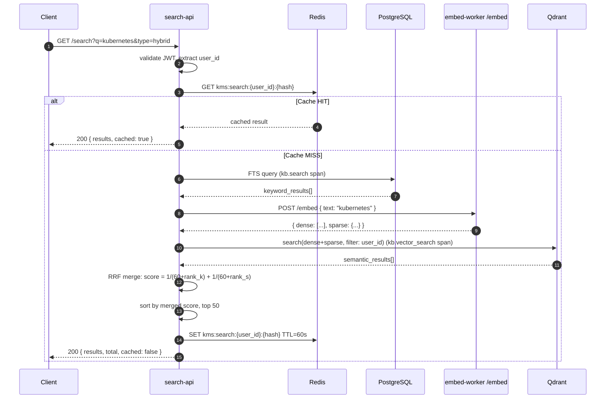

# PRD: M05 — Search & Discovery

## Status

`Approved`

**Created**: 2026-03-17
**Depends on**: M00, M01, M03 (extraction), M04 (embeddings)

---

## Business Context

Search is the primary user interaction with KMS. Users need to find files they dimly remember — by content keyword, by conceptual similarity, or by a combination of both. search-api is a dedicated read-only service (never writes) that delivers sub-500ms results for keyword queries and sub-1s for semantic queries. Redis caching means repeated queries are instant.

---

## User Stories

| As a... | I want to... | So that... |
|---------|-------------|-----------|
| User | Search for files by keyword | I can find documents containing specific terms |
| User | Search by meaning ("files about project planning") | I can find conceptually related content even with different words |
| User | Get highlighted snippets | I can see why a result matched without opening the file |
| User | Filter results by source, date, file type | I can narrow large result sets |
| User | Switch between keyword/semantic/hybrid modes | I can choose the right tool for my query |

---

## Scope

**In scope:**
- `search-api`: dedicated read-only NestJS service (port 8001)
- Three search modes: keyword (PostgreSQL FTS), semantic (Qdrant ANN), hybrid (RRF merge)
- Per-user result isolation (user_id filter on all queries)
- Redis result caching (60s TTL)
- Highlighted text snippets in results
- Pagination (page + limit)
- Source / MIME type / date range filters

**Out of scope:**
- Full-text search across file names only (search is on extracted chunk content)
- Cross-user search (no admin search-all)
- Real-time search-as-you-type (client-side debounce, not server-side streaming)
- Saved search / search alerts (post-MVP)

---

## Functional Requirements

| ID | Requirement | Priority |
|----|-------------|----------|
| FR-01 | `GET /api/v1/search?q=&type=keyword` — full-text search, ranked by `ts_rank` | Must |
| FR-02 | `GET /api/v1/search?q=&type=semantic` — embed query, Qdrant ANN, ranked by cosine score | Must (feature-gated) |
| FR-03 | `GET /api/v1/search?q=&type=hybrid` — RRF merge of keyword + semantic | Should (feature-gated) |
| FR-04 | `GET /api/v1/search?q=&type=auto` — keyword if embedding disabled, hybrid if enabled | Must |
| FR-05 | Result shape: `{ file_id, name, source_id, mime_type, snippet, score, created_at }` | Must |
| FR-06 | Snippet: `ts_headline` with 2 fragments for keyword; first 200 chars for semantic | Must |
| FR-07 | Filter: `source_id=`, `mime_type=`, `from_date=`, `to_date=` query params | Should |
| FR-08 | Pagination: `page` (1-based) + `limit` (max 50) + `total` in response | Must |
| FR-09 | Cache: identical `(user_id, query, params)` → Redis hit, skip DB/Qdrant | Must |
| FR-10 | Cache invalidation: clear `kms:search:{user_id}:*` when user's files change | Should |
| FR-11 | Throttle: 30 req/min per user (Throttler module) | Must |

---

## Non-Functional Requirements

| Concern | Requirement |
|---------|-------------|
| Keyword p95 | < 200ms (with GIN index + Redis cache) |
| Semantic p95 | < 800ms (Qdrant ANN + query embedding) |
| Hybrid p95 | < 1000ms (both + RRF merge) |
| Cache hit | < 20ms |
| Max results | 50 per page, max 10 pages (500 total) |
| Isolation | User A cannot see User B's results — enforced by `user_id` filter on every query |

---

## Flow Diagram



---

## RRF Algorithm

```typescript
// Reciprocal Rank Fusion — k=60 (standard value)
function rrf(keywordResults: SearchResult[], semanticResults: SearchResult[], k = 60): SearchResult[] {
  const scores = new Map<string, number>();

  keywordResults.forEach((r, i) => {
    scores.set(r.fileId, (scores.get(r.fileId) ?? 0) + 1 / (k + i + 1));
  });

  semanticResults.forEach((r, i) => {
    scores.set(r.fileId, (scores.get(r.fileId) ?? 0) + 1 / (k + i + 1));
  });

  return [...scores.entries()]
    .sort(([, a], [, b]) => b - a)
    .map(([fileId, score]) => ({ fileId, score }));
}
```

---

## Error Codes

| Code | HTTP | Description |
|------|------|-------------|
| `KBSCH0001` | 400 | Query string empty |
| `KBSCH0002` | 400 | Invalid search type |
| `KBSCH0003` | 503 | Semantic search unavailable (embedding disabled) |
| `KBSCH0004` | 503 | Qdrant unreachable |
| `KBSCH0005` | 429 | Rate limit exceeded |

---

## DB Indexes

```sql
-- GIN index for full-text search
CREATE INDEX idx_kms_chunks_search_vector
    ON kms_chunks USING gin(search_vector);

-- Generated tsvector column
ALTER TABLE kms_chunks
    ADD COLUMN search_vector tsvector
    GENERATED ALWAYS AS (to_tsvector('english', content)) STORED;

-- Composite index for user_id filtering
CREATE INDEX idx_kms_chunks_user_id
    ON kms_chunks (user_id, created_at DESC);
```

---

## Redis Keys

| Key | Value | TTL |
|-----|-------|-----|
| `kms:search:{user_id}:{sha256(q+params)}` | Serialized result array | 60s |

---

## Testing Plan

| Test Type | Scope | Key Cases |
|-----------|-------|-----------|
| Unit | `HybridSearchService.rrf()` | Empty lists, single side only, score ordering |
| Unit | `KeywordSearchService` | SQL query construction, snippet format |
| Integration | Keyword search vs real DB | Known content → found in results |
| Integration | Cache hit | Second request = Redis response |
| E2E | Hybrid search | Upload file → scan → embed → search by content → appears in results |

---

## ADR Links

- [ADR-0009](../architecture/decisions/0009-bge-m3-embedding-model.md) (BGE-M3 for query embedding)
- [ADR-0010](../architecture/decisions/0010-qdrant-vector-db.md) (Qdrant for semantic search)
