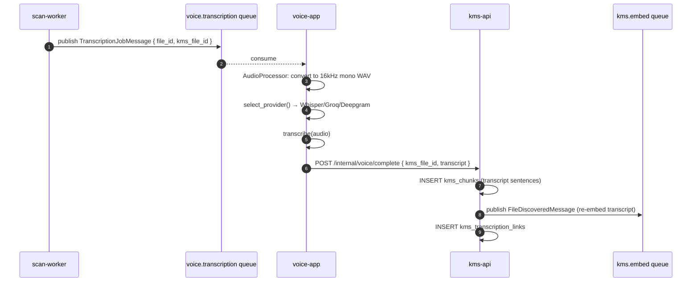

# PRD: M08 — Voice Transcription Integration

## Status

`Approved`

**Created**: 2026-03-17
**Depends on**: M00, M01, M02 (files discovered), M03 (pipeline established)

---

## Business Context

KMS inherits a working voice transcription prototype (voice-app). This module integrates it into the KMS pipeline: audio/video files discovered by scan-worker are auto-queued for transcription; transcripts are stored, indexed as searchable chunks, and displayed in the file detail view with a synchronized media player. Users can also manually trigger transcription with a provider preference.

---

## Functional Requirements

| ID | Requirement | Priority |
|----|-------------|----------|
| FR-01 | Auto-trigger: scan-worker detects audio/video MIME → publish to `voice.transcription` | Must |
| FR-02 | `POST /api/v1/files/{id}/transcribe { provider? }` — manual trigger | Must |
| FR-03 | `GET /api/v1/files/{id}/transcription` — fetch transcript for a file | Must |
| FR-04 | `GET /api/v1/transcriptions/{id}/download?format=txt|srt|json` | Must |
| FR-05 | On transcript complete: insert transcript text as `kms_chunks`, publish to `kms.embed` | Must |
| FR-06 | Provider fallback: Whisper → Groq → Deepgram (use `is_available()` check) | Must |
| FR-07 | voice-app: webhook `POST /api/v1/internal/voice/complete` on job done | Must |
| FR-08 | voice-app: migrate from `create_all` to Alembic migrations | Must |
| FR-09 | voice-app: migrate stdlib logging → structlog | Must |
| FR-10 | `kms_transcription_links`: link voice transcript to kms file | Must |

---

## Supported Formats

`mp3`, `wav`, `mp4`, `mov`, `m4a`, `ogg`, `webm`, `flac`
Max file size: 500MB (configurable)

---

## Flow Diagram



---

## DB Schema

```sql
CREATE TABLE kms_transcription_links (
    id UUID PRIMARY KEY DEFAULT gen_random_uuid(),
    kms_file_id UUID NOT NULL REFERENCES kms_files(id) ON DELETE CASCADE,
    voice_transcription_id UUID NOT NULL,  -- UUID ref to voice_transcriptions (no FK)
    provider VARCHAR(30),
    linked_at TIMESTAMPTZ DEFAULT NOW()
);
```

---

## Testing Plan

| Test | Key Cases |
|------|-----------|
| Unit | Provider fallback chain — Whisper fails → Groq tried |
| Unit | MIME type detection → correct transcription trigger |
| E2E | Upload MP3 → scan → transcribed → transcript searchable |
