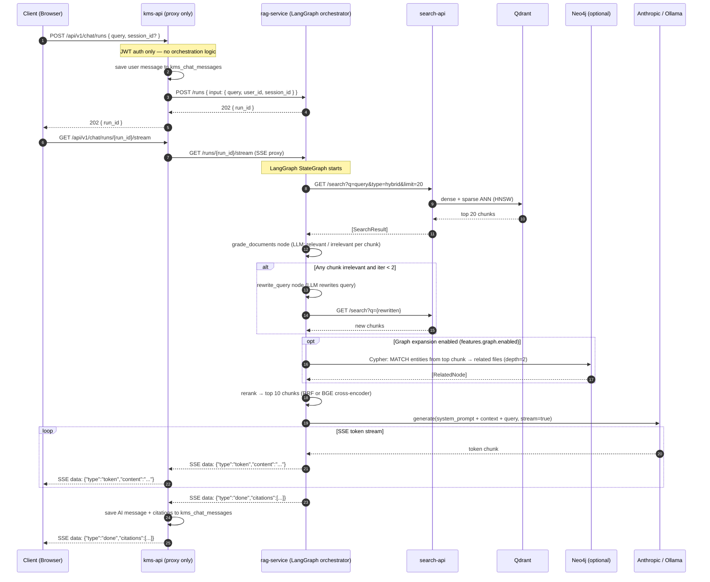

# PRD: M10 — RAG Chat & Agent Orchestration

## Status

`Approved`

**Created**: 2026-03-17
**Depends on**: M00, M01, M04 (embeddings), M05 (search), feature-flagged

---

## Business Context

KMS holds a user's entire knowledge base. RAG chat makes that knowledge conversational: instead of browsing and searching manually, users ask questions and get grounded answers with citations pointing to the exact source files and chunks. The local-first LLM approach (Ollama) ensures privacy and zero API cost for most usage, with cloud fallback (OpenRouter) when needed. The feature is always behind a feature flag — disabled in config.json by default until LLM and embeddings are enabled.

---

## User Stories

| As a... | I want to... | So that... |
|---------|-------------|-----------|
| User | Ask "What was decided in the Q4 planning meeting?" | I get an answer grounded in my uploaded notes |
| User | See which files the AI is reading | I can verify the answer's sources |
| User | Click a citation | I'm taken to the exact file and position |
| User | Continue a conversation | The AI remembers context from earlier in the session |
| User | Start a new chat | I get a clean context without prior session interference |

---

## Scope

**In scope:**
- `rag-service` (Python FastAPI) is the **sole orchestrator** — LangGraph StateGraph coordinates all sub-agents internally
- `kms-api` exposes `/chat/runs` as a thin auth-gated proxy to `rag-service` — no orchestration logic in NestJS
- `rag-service` run-lifecycle endpoints: `POST /runs`, `GET /runs/{id}`, `GET /runs/{id}/stream` (SSE), `DELETE /runs/{id}`
- LangGraph pipeline inside `rag-service`: retrieve (→ search-api) → grade → rewrite (max 2x) → graph expand (optional) → generate
- SSE streaming: tokens streamed rag-service → kms-api → browser
- Citations: `[N] filename.pdf — chunk excerpt`
- Session history: persist conversation per user (Redis + PostgreSQL)
- LLM providers: Anthropic Claude API (primary), Ollama (local/offline), graceful fallback
- Feature gate: `features.rag.enabled = false` → return 503

**Out of scope:**
- Voice input to chat (post-MVP)
- Chat export (post-MVP)
- Shared chat sessions (private only for MVP)

---

## Functional Requirements

| ID | Requirement | Priority |
|----|-------------|----------|
| FR-01 | `POST /api/v1/chat/completions { query, session_id? }` — start RAG query | Must |
| FR-02 | Response: SSE stream `data: {"token": "...", "done": false}` until `{"done": true}` | Must |
| FR-03 | Final SSE message includes `citations: [{ file_id, file_name, chunk_index, excerpt }]` | Must |
| FR-04 | `GET /api/v1/chat/sessions` — list user's sessions | Must |
| FR-05 | `GET /api/v1/chat/sessions/{id}/messages` — full conversation history | Must |
| FR-06 | `DELETE /api/v1/chat/sessions/{id}` — delete session | Must |
| FR-07 | rag-service: LangGraph pipeline with grade → rewrite loop (max 2 iterations) | Must |
| FR-08 | rag-service: hybrid retrieval (calls search-api) — top 20 chunks | Must |
| FR-09 | rag-service: reranker selects top 10 chunks for context window | Should |
| FR-10 | Feature gate: `features.rag.enabled = false` → 503 `KBRAG0001` | Must |
| FR-11 | LLM unavailable: return retrieved context without generation (graceful degrade) | Must |

---

## Non-Functional Requirements

| Concern | Requirement |
|---------|-------------|
| Time to first token | < 3 seconds |
| Full response (500 words) | < 30 seconds on local Ollama llama3.2:3b |
| Max context chunks | 10 chunks (configurable in config.json) |
| Session message limit | 50 messages per session (archive older) |
| Privacy | All LLM calls local by default; cloud = opt-in |

---

## Flow Diagram



---

## LangGraph Pipeline Nodes

```
[retrieve]
    ↓
[grade_documents]  ← binary: relevant / irrelevant
    ↓ (all relevant)        ↓ (not relevant, iter < 2)
[rerank]            [rewrite_query] → [retrieve]
    ↓
[generate]  ← streaming SSE
```

---

## Error Codes

| Code | HTTP | Description |
|------|------|-------------|
| `KBRAG0001` | 503 | RAG feature disabled (features.rag.enabled = false) |
| `KBRAG0002` | 503 | LLM provider unavailable |
| `KBRAG0003` | 503 | search-api unreachable |
| `KBRAG0004` | 400 | Query too long (> 500 chars) |
| `KBRAG0005` | 404 | Chat session not found |
| `KBRAG0006` | 400 | No relevant content found for query |

---

## DB Schema

```sql
CREATE TABLE kms_chat_sessions (
    id UUID PRIMARY KEY DEFAULT gen_random_uuid(),
    user_id UUID NOT NULL,
    title VARCHAR(255),  -- auto-generated from first message
    created_at TIMESTAMPTZ DEFAULT NOW(),
    updated_at TIMESTAMPTZ DEFAULT NOW()
);

CREATE TABLE kms_chat_messages (
    id UUID PRIMARY KEY DEFAULT gen_random_uuid(),
    session_id UUID NOT NULL REFERENCES kms_chat_sessions(id) ON DELETE CASCADE,
    role VARCHAR(10) NOT NULL,  -- user | assistant
    content TEXT NOT NULL,
    citations_json JSONB DEFAULT '[]',
    created_at TIMESTAMPTZ DEFAULT NOW()
);
```

---

## ACP Endpoints (rag-service)

| Method | Path | Description |
|--------|------|-------------|
| `GET` | `/agents` | List available agents + capabilities |
| `POST` | `/runs` | Start a RAG run, return `{ run_id }` |
| `GET` | `/runs/{id}` | Poll run status + final result |
| `GET` | `/runs/{id}/stream` | SSE stream of tokens |
| `DELETE` | `/runs/{id}` | Cancel a run |

---

## Redis Keys

| Key | Value | TTL |
|-----|-------|-----|
| `kms:rag:run:{run_id}` | Run state JSON | 10 minutes |
| `kms:chat:session:{session_id}:context` | Recent messages for context | 30 minutes |

---

## Configuration

| Config Key | Description | Default |
|-----------|-------------|---------|
| `features.rag.enabled` | Master feature gate | `false` |
| `llm.enabled` | LLM provider enabled | `false` |
| `llm.provider` | `ollama` or `openrouter` | `ollama` |
| `llm.ollamaModel` | Local model name | `llama3.2:3b` |
| `features.rag.maxContextChunks` | Max chunks in LLM context | `10` |

---

## Testing Plan

| Test Type | Scope | Key Cases |
|-----------|-------|-----------|
| Unit | `RAGAgent.grade_documents()` | All relevant → skip rewrite; irrelevant → rewrite triggered |
| Unit | LangGraph graph | Max 2 rewrite iterations enforced |
| Integration | ACP endpoints | POST /runs → GET /runs/{id}/stream returns SSE |
| E2E | Full RAG flow | Index file → ask question → get answer with citation to that file |
| E2E | LLM unavailable | Graceful degradation: return chunks without generation |

---

## ADR Links

- [ADR-0012](../architecture/decisions/0012-acp-protocol.md) (ACP protocol)
- [ADR-0013](../architecture/decisions/0013-orchestrator-pattern.md) (LangGraph inside rag-service)
- [ADR-0009](../architecture/decisions/0009-bge-m3-embedding-model.md) (BGE-M3 for query embedding)
