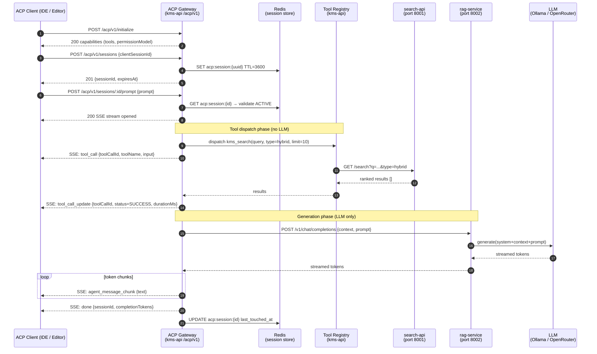

# PRD-M13: ACP Integration — Knowledge Agent Protocol

- **Status**: Draft
- **Module**: M13
- **Author**: Claude Code (claude-sonnet-4-6)
- **Created**: 2026-03-17
- **Updated**: 2026-03-17

---

## 1. Business Context

The KMS RAG pipeline currently routes all four LangGraph nodes (retrieve, grade, rewrite, generate) through an LLM, creating unnecessary latency and cost for inherently deterministic operations like document retrieval, relevance scoring, and query expansion. Adopting the Agent Client Protocol (ACP) as the internal communication standard provides a structured, permission-aware interface between clients (editors, IDEs, external agents) and KMS intelligence, while simultaneously enabling the refactoring of three out of four LangGraph nodes to use deterministic tool calls instead of LLM inference. ADR-0012 (ACP as agent protocol) and ADR-0013 (custom NestJS orchestrator + LangGraph in rag-service) have already been accepted; this PRD defines the full implementation scope for M13.

---

## 2. User Stories

| ID    | As a...              | I want to...                                                                 | So that...                                                                              |
|-------|----------------------|------------------------------------------------------------------------------|-----------------------------------------------------------------------------------------|
| US-01 | Developer (IDE user) | Connect my editor to KMS via ACP over HTTP                                   | I can query my knowledge base from within my coding environment                        |
| US-02 | Developer (IDE user) | Invoke `kms_search` as an ACP tool call from my client                       | I get semantically ranked results without writing custom API calls                     |
| US-03 | Developer (IDE user) | Receive streaming SSE events during a prompt run                             | I see incremental output and can cancel long-running agent tasks                       |
| US-04 | KMS administrator    | Control which ACP tools are enabled via feature flags                        | I can expose search/retrieve safely while keeping ingest disabled by default           |
| US-05 | KMS platform team    | See every ACP tool call logged to `kms_acp_tool_calls`                       | I can audit tool usage, debug failures, and bill per-tool if needed                   |
| US-06 | RAG pipeline         | Have retrieve, grade, and rewrite nodes use deterministic tool calls         | LLM is invoked only for generation, reducing p95 latency and token cost               |
| US-07 | Security team        | Require explicit permission round-trips before write-class tools execute     | No tool with side effects (e.g., `kms_ingest`) runs without acknowledged user consent  |
| US-08 | Developer            | Cancel an in-flight ACP session via `DELETE /acp/v1/sessions/:id`           | Long-running prompts do not consume resources after the client disconnects             |

---

## 3. Scope

### In Scope

- ACP HTTP Gateway NestJS module (`kms-api/src/modules/acp/`)
  - Session lifecycle endpoints: initialize, newSession, prompt (SSE streaming), cancel/delete, status
  - JWT-authenticated; session state persisted in Redis with configurable TTL
  - Permission model: reads auto-approved, writes require explicit `request_permission` round-trip
- KMS Tool Registry — five ACP tools: `kms_search`, `kms_retrieve`, `kms_graph_expand`, `kms_embed`, `kms_ingest`
- RAG-service LangGraph node refactor
  - `[retrieve]` → `kms_search` tool call (no LLM)
  - `[grade_documents]` → score-threshold filter (no LLM)
  - `[rewrite_query]` → `kms_graph_expand` entity enrichment (no LLM)
  - `[generate]` → LLM-only node (unchanged)
- New DB tables: `kms_acp_sessions`, `kms_acp_tool_calls`
- Error code domain KBACP0001–KBACP0010
- Feature flags under `acp.*`
- Prisma migration + repository layer for new tables
- Unit, integration, and E2E tests
- Phase 2: `kms_search` self-dispatch in `kms-api` SearchService (replaces search-api proxy call)
- Phase 3: `kms_ingest` integration in scan-worker, dedup-worker, voice-app (replaces direct DB writes)
- Phase 4: `kms_graph_expand` integration in graph-worker (replaces direct Neo4j queries in workers)
- Cross-service ACP tool observability (single OTel trace spans across all tool callers)

### Out of Scope

- stdio / subprocess ACP transport (HTTP-only for M13; stdio deferred to M14)
- Multi-agent orchestration or agent-to-agent delegation
- ACP SDK (`@agentclientprotocol/sdk`) wrapper library — raw protocol implementation only
- OAuth2 / non-JWT authentication for ACP sessions
- UI for managing ACP sessions in the frontend
- Billing or rate-limiting per ACP tool invocation
- Embedding model swap (still BAAI/bge-m3 at 1024 dimensions)
- Workflow Engine and multi-agent orchestration (covered in PRD-M14)
- Sub-agent spawning (covered in PRD-M14)

---

## 4. Functional Requirements

| ID    | Priority | Requirement                                                                                                                                              |
|-------|----------|----------------------------------------------------------------------------------------------------------------------------------------------------------|
| FR-01 | Must     | `POST /acp/v1/initialize` returns agent capabilities (name, version, supported tools list) without creating a session                                    |
| FR-02 | Must     | `POST /acp/v1/sessions` creates a Redis-backed session with a UUID sessionId; returns sessionId and expiry timestamp                                     |
| FR-03 | Must     | `POST /acp/v1/sessions/:id/prompt` accepts a user prompt and streams SSE events: `agent_message_chunk`, `tool_call`, `tool_call_update`, `done`, `error` |
| FR-04 | Must     | `DELETE /acp/v1/sessions/:id` cancels any in-flight prompt and marks session `CANCELLED` in Redis and DB                                                |
| FR-05 | Must     | `GET /acp/v1/sessions/:id/status` returns current session status (`ACTIVE`, `IDLE`, `CANCELLED`, `EXPIRED`)                                             |
| FR-06 | Must     | All ACP endpoints require a valid JWT (`Authorization: Bearer <token>`); missing or invalid JWT returns 401 with KBACP0001                               |
| FR-07 | Must     | Sessions expire after `acp.sessionTtlSeconds` (default 3600); expired session access returns 404 with KBACP0003                                         |
| FR-08 | Must     | `kms_search` tool dispatches to search-api and returns ranked results; accepts `query`, `type` (`keyword`/`semantic`/`hybrid`), `limit`, `collection_ids` |
| FR-09 | Must     | `kms_retrieve` tool fetches a specific chunk from Qdrant by `file_id` and optional `chunk_index`                                                        |
| FR-10 | Must     | `kms_graph_expand` tool performs Neo4j traversal from given `entities` up to `max_hops` depth                                                           |
| FR-11 | Must     | `kms_embed` tool calls embed-worker via AMQP and returns a 1024-dimension BGE-M3 vector                                                                 |
| FR-12 | Should   | `kms_ingest` tool enqueues a scan job to `kms.scan` queue; disabled by default (`toolRegistry.ingest: false`)                                           |
| FR-13 | Must     | Write-class tools (`kms_ingest`) emit a `request_permission` event before executing; execution proceeds only if client responds with `permission_granted` |
| FR-14 | Must     | All tool calls are persisted to `kms_acp_tool_calls` with input, output, status, and `duration_ms`                                                      |
| FR-15 | Must     | All sessions are persisted to `kms_acp_sessions` with user_id, agent_id, session_meta, and status                                                       |
| FR-16 | Must     | RAG-service `[retrieve]` node calls `kms_search` via ACP tool dispatch instead of direct HTTP — no LLM invocation                                       |
| FR-17 | Must     | RAG-service `[grade_documents]` node applies score-threshold filter (configurable, default 0.5) — no LLM invocation                                     |
| FR-18 | Must     | RAG-service `[rewrite_query]` node calls `kms_graph_expand` to enrich entities — no LLM invocation                                                      |
| FR-19 | Must     | RAG-service `[generate]` node remains the single LLM-calling node (Ollama/OpenRouter); all other nodes must not call LLM                                |
| FR-20 | Must     | Feature flag `acp.enabled: false` must cause all ACP endpoints to return 503 with KBACP0009                                                             |
| FR-21 | Should   | Per-tool flags under `acp.toolRegistry.*` disable individual tools at runtime; disabled tool call returns KBACP0010                                     |
| FR-22 | Must     | Error responses follow the standard KB error envelope: `{ code, message, statusCode, traceId }`                                                         |
| FR-23 | Should   | ACP session creation is idempotent if client supplies a stable `clientSessionId` in the request body                                                    |
| FR-24 | Could    | `GET /acp/v1/sessions` (paginated) lists active sessions for the authenticated user                                                                      |

---

## 5. Non-Functional Requirements

### Performance

- Session creation (`POST /acp/v1/sessions`): p95 < 50 ms end-to-end
- Tool call dispatch (`kms_search`, `kms_retrieve`): p95 < 200 ms excluding downstream service latency
- `kms_graph_expand` (Neo4j): p95 < 500 ms for max_hops ≤ 2
- `kms_embed`: p95 < 300 ms (AMQP round-trip to embed-worker)
- First SSE chunk for a prompt: p95 < 800 ms from request receipt
- RAG pipeline total latency reduction: ≥ 40% compared to pre-M13 baseline (three LLM calls eliminated)

### Security

- All endpoints must be JWT-protected; session tokens must not be accepted as JWT substitutes
- Session IDs must be UUIDs v4; sequential or predictable IDs are not acceptable
- Tool input must be validated against JSON Schema before dispatch; malformed input returns KBACP0006
- `kms_ingest` must always require explicit `request_permission` regardless of `permissionMode` flag setting
- Tool output stored in `kms_acp_tool_calls.output_json` must be size-capped at 64 KB; excess truncated with a flag
- Redis session keys must be namespaced: `acp:session:{sessionId}`

### Scalability

- ACP gateway must be stateless in kms-api; all session state lives in Redis
- Tool registry must support horizontal scaling of kms-api instances without coordination
- AMQP-backed tools (`kms_embed`, `kms_ingest`) must use publish-confirm to avoid silent message loss

### Availability

- ACP gateway availability follows kms-api SLA (99.5% uptime target)
- Redis unavailability must return 503 KBACP0008 rather than a crash
- Individual tool failures must not terminate the SSE stream; a `tool_call_error` event is emitted and the agent may proceed

### Data Retention

- `kms_acp_sessions` rows: retained for 90 days after last_touched_at; purged by a nightly cron job
- `kms_acp_tool_calls` rows: retained for 30 days; purged by the same cron job
- Redis session keys: expire automatically at `acp.sessionTtlSeconds`; no explicit cleanup needed

---

## 6. Data Model Changes

```sql
-- Migration: 20260317000001_add_acp_tables

CREATE TYPE acp_session_status AS ENUM ('ACTIVE', 'IDLE', 'CANCELLED', 'EXPIRED');
CREATE TYPE acp_tool_call_status AS ENUM ('PENDING', 'SUCCESS', 'FAILED', 'TIMEOUT');

CREATE TABLE kms_acp_sessions (
    id             UUID PRIMARY KEY DEFAULT gen_random_uuid(),
    user_id        UUID NOT NULL REFERENCES auth_users(id) ON DELETE CASCADE,
    agent_id       TEXT NOT NULL DEFAULT 'kms-agent-v1',
    status         acp_session_status NOT NULL DEFAULT 'ACTIVE',
    session_meta   JSONB NOT NULL DEFAULT '{}',
    created_at     TIMESTAMPTZ NOT NULL DEFAULT NOW(),
    last_touched_at TIMESTAMPTZ NOT NULL DEFAULT NOW(),
    expires_at     TIMESTAMPTZ NOT NULL,
    client_session_id TEXT,                          -- optional client-supplied stable id for idempotency
    CONSTRAINT uq_acp_sessions_client_id UNIQUE (user_id, client_session_id)
);

CREATE INDEX idx_acp_sessions_user_id     ON kms_acp_sessions (user_id);
CREATE INDEX idx_acp_sessions_status      ON kms_acp_sessions (status);
CREATE INDEX idx_acp_sessions_expires_at  ON kms_acp_sessions (expires_at);

CREATE TABLE kms_acp_tool_calls (
    id           UUID PRIMARY KEY DEFAULT gen_random_uuid(),
    session_id   UUID NOT NULL REFERENCES kms_acp_sessions(id) ON DELETE CASCADE,
    tool_name    TEXT NOT NULL,
    input_json   JSONB NOT NULL,
    output_json  JSONB,
    output_truncated BOOLEAN NOT NULL DEFAULT FALSE,
    status       acp_tool_call_status NOT NULL DEFAULT 'PENDING',
    duration_ms  INTEGER,
    error_code   TEXT,
    error_message TEXT,
    created_at   TIMESTAMPTZ NOT NULL DEFAULT NOW(),
    completed_at TIMESTAMPTZ
);

CREATE INDEX idx_acp_tool_calls_session_id  ON kms_acp_tool_calls (session_id);
CREATE INDEX idx_acp_tool_calls_tool_name   ON kms_acp_tool_calls (tool_name);
CREATE INDEX idx_acp_tool_calls_created_at  ON kms_acp_tool_calls (created_at);
```

**Prisma schema additions** (`kms-api/prisma/schema.prisma`):

```prisma
model KmsAcpSession {
  id              String           @id @default(uuid())
  userId          String           @map("user_id")
  agentId         String           @default("kms-agent-v1") @map("agent_id")
  status          AcpSessionStatus @default(ACTIVE)
  sessionMeta     Json             @default("{}") @map("session_meta")
  createdAt       DateTime         @default(now()) @map("created_at")
  lastTouchedAt   DateTime         @default(now()) @map("last_touched_at")
  expiresAt       DateTime         @map("expires_at")
  clientSessionId String?          @map("client_session_id")
  user            AuthUser         @relation(fields: [userId], references: [id], onDelete: Cascade)
  toolCalls       KmsAcpToolCall[]

  @@unique([userId, clientSessionId])
  @@map("kms_acp_sessions")
}

model KmsAcpToolCall {
  id              String              @id @default(uuid())
  sessionId       String              @map("session_id")
  toolName        String              @map("tool_name")
  inputJson       Json                @map("input_json")
  outputJson      Json?               @map("output_json")
  outputTruncated Boolean             @default(false) @map("output_truncated")
  status          AcpToolCallStatus   @default(PENDING)
  durationMs      Int?                @map("duration_ms")
  errorCode       String?             @map("error_code")
  errorMessage    String?             @map("error_message")
  createdAt       DateTime            @default(now()) @map("created_at")
  completedAt     DateTime?           @map("completed_at")
  session         KmsAcpSession       @relation(fields: [sessionId], references: [id], onDelete: Cascade)

  @@map("kms_acp_tool_calls")
}

enum AcpSessionStatus {
  ACTIVE
  IDLE
  CANCELLED
  EXPIRED
}

enum AcpToolCallStatus {
  PENDING
  SUCCESS
  FAILED
  TIMEOUT
}
```

---

## 7. API Contract

### Endpoint Table

| Method   | Path                              | Auth | Description                          |
|----------|-----------------------------------|------|--------------------------------------|
| POST     | `/acp/v1/initialize`              | JWT  | Handshake — return agent capabilities |
| POST     | `/acp/v1/sessions`                | JWT  | Create a new session                  |
| GET      | `/acp/v1/sessions/:id/status`     | JWT  | Get session status                    |
| POST     | `/acp/v1/sessions/:id/prompt`     | JWT  | Run prompt, stream SSE events         |
| DELETE   | `/acp/v1/sessions/:id`            | JWT  | Cancel / close session                |

---

### `POST /acp/v1/initialize`

**Request body**: none (empty `{}` accepted)

**Response 200**:
```json
{
  "protocol": "acp",
  "version": "1.0",
  "agent": {
    "id": "kms-agent-v1",
    "name": "KMS Knowledge Agent",
    "description": "Retrieval-augmented knowledge assistant with tool-calling support"
  },
  "capabilities": {
    "streaming": true,
    "tools": ["kms_search", "kms_retrieve", "kms_graph_expand", "kms_embed"],
    "permissionModel": "approve-reads",
    "transports": ["http"]
  }
}
```

**Errors**: 503 KBACP0009 (acp.enabled is false)

---

### `POST /acp/v1/sessions`

**Request body**:
```json
{
  "clientSessionId": "editor-session-abc123",   // optional, for idempotency
  "meta": {                                      // optional arbitrary client metadata
    "editor": "vscode",
    "workspaceId": "proj-42"
  }
}
```

**Response 201**:
```json
{
  "sessionId": "a1b2c3d4-e5f6-7890-abcd-ef1234567890",
  "expiresAt": "2026-03-17T14:00:00Z",
  "status": "ACTIVE",
  "agentId": "kms-agent-v1"
}
```

**Errors**:
- 401 KBACP0001 (missing/invalid JWT)
- 503 KBACP0008 (Redis unavailable)
- 503 KBACP0009 (feature disabled)

---

### `GET /acp/v1/sessions/:id/status`

**Response 200**:
```json
{
  "sessionId": "a1b2c3d4-e5f6-7890-abcd-ef1234567890",
  "status": "ACTIVE",
  "createdAt": "2026-03-17T10:00:00Z",
  "lastTouchedAt": "2026-03-17T10:05:00Z",
  "expiresAt": "2026-03-17T11:00:00Z"
}
```

**Errors**:
- 401 KBACP0001
- 403 KBACP0002 (session belongs to different user)
- 404 KBACP0003 (session not found or expired)

---

### `POST /acp/v1/sessions/:id/prompt`

**Request body**:
```json
{
  "prompt": "Find all documents related to RAG pipeline architecture",
  "options": {
    "collectionIds": ["col-uuid-1", "col-uuid-2"],   // optional scope
    "searchType": "hybrid",                           // keyword | semantic | hybrid
    "maxResults": 10
  }
}
```

**Response**: `Content-Type: text/event-stream` (SSE)

**Event shapes** (NDJSON over SSE `data:` field):

```
data: {"event":"tool_call","toolCallId":"tc-001","toolName":"kms_search","input":{"query":"RAG pipeline architecture","type":"hybrid","limit":10}}

data: {"event":"tool_call_update","toolCallId":"tc-001","status":"SUCCESS","durationMs":143}

data: {"event":"agent_message_chunk","text":"Based on your knowledge base, here are the most relevant documents:\n\n"}

data: {"event":"agent_message_chunk","text":"1. **RAG Pipeline Design** (score: 0.94) — docs/prd/PRD-rag-service.md\n"}

data: {"event":"done","sessionId":"a1b2c3d4-...","promptTokens":0,"completionTokens":148}
```

**Permission round-trip** (for write tools):
```
data: {"event":"request_permission","toolCallId":"tc-002","toolName":"kms_ingest","description":"Trigger ingestion of source src-uuid-1","risk":"write"}

// Client must POST /acp/v1/sessions/:id/permission with { toolCallId, granted: true/false }
// If not responded within 30s, auto-denied with KBACP0007
```

**Error event**:
```
data: {"event":"error","code":"KBACP0005","message":"Tool kms_search failed: search-api unreachable","retryable":true}
```

**Errors** (non-SSE, before stream opens):
- 401 KBACP0001
- 403 KBACP0002
- 404 KBACP0003
- 422 KBACP0006 (invalid prompt input)

---

### `DELETE /acp/v1/sessions/:id`

**Request body**: none

**Response 204**: no body

**Errors**:
- 401 KBACP0001
- 403 KBACP0002
- 404 KBACP0003

---

### Tool Input/Output Schemas

#### `kms_search`
```json
// Input
{
  "query": "string (required)",
  "type": "keyword | semantic | hybrid (default: hybrid)",
  "limit": "integer 1-50 (default: 10)",
  "collection_ids": ["uuid", "..."]   // optional
}
// Output
{
  "results": [
    { "fileId": "uuid", "chunkIndex": 0, "score": 0.94, "text": "...", "metadata": {} }
  ],
  "total": 3,
  "searchType": "hybrid"
}
```

#### `kms_retrieve`
```json
// Input
{ "file_id": "uuid (required)", "chunk_index": 0 }
// Output
{ "fileId": "uuid", "chunkIndex": 0, "text": "...", "metadata": {}, "embedding": null }
```

#### `kms_graph_expand`
```json
// Input
{ "entities": ["RAG", "LangGraph"], "max_hops": 2 }
// Output
{
  "nodes": [{ "id": "n1", "label": "Concept", "name": "RAG" }],
  "edges": [{ "from": "n1", "to": "n2", "relation": "USES" }],
  "expandedEntities": ["RAG", "LangGraph", "LLM", "Retriever"]
}
```

#### `kms_embed`
```json
// Input
{ "text": "string (required, max 8192 chars)" }
// Output
{ "embedding": [0.012, -0.034, ...], "dimensions": 1024, "model": "BAAI/bge-m3" }
```

#### `kms_ingest`
```json
// Input
{ "source_id": "uuid (required)" }
// Output
{ "jobId": "uuid", "queued": true, "queuedAt": "2026-03-17T10:00:00Z" }
```

---

### Error Code Registry (KBACP domain)

| Code       | HTTP Status | Meaning                                                               |
|------------|-------------|-----------------------------------------------------------------------|
| KBACP0001  | 401         | Missing or invalid JWT; authentication required                       |
| KBACP0002  | 403         | Session belongs to a different authenticated user                     |
| KBACP0003  | 404         | Session not found or has expired                                      |
| KBACP0004  | 409         | Session is already CANCELLED; cannot reuse                            |
| KBACP0005  | 502         | Tool dispatch failed; upstream service (search-api, Qdrant, etc.) unreachable |
| KBACP0006  | 422         | Tool input failed JSON Schema validation                              |
| KBACP0007  | 408         | Permission request timed out (no client response within 30 s)        |
| KBACP0008  | 503         | Redis unavailable; session operations cannot proceed                  |
| KBACP0009  | 503         | ACP feature flag `acp.enabled` is false                               |
| KBACP0010  | 503         | Requested tool is disabled via `acp.toolRegistry.<tool>: false`      |

---

## 8. Flow Diagram



---

## 9. Decisions Required

The following open questions must be resolved before this PRD moves to **Approved** status. Each must produce an ADR.

1. **Permission grant transport** — Should the `permission_granted` acknowledgement from the client travel over the existing SSE stream (bidirectional SSE) or as a separate `POST /acp/v1/sessions/:id/permission` endpoint? The separate endpoint is simpler but adds a round-trip. *(Blocking for FR-13)*

2. **RAG-service ACP client** — Should rag-service call tools directly (function calls within the process) or go through the kms-api ACP gateway over HTTP? Direct calls eliminate network overhead but couple rag-service to tool implementations. *(Blocking for FR-16–FR-19)*

3. **Session concurrency model** — Should a single session support multiple concurrent in-flight prompts, or must prompts be serialized per session? Serialized is simpler but limits throughput for batch clients. *(Affects Redis data model)*

4. **`kms_embed` synchrony** — embed-worker is an AMQP consumer with no synchronous response path. Should `kms_embed` use a reply-queue pattern (AMQP RPC) or should a new synchronous HTTP endpoint be added to embed-worker? *(Blocking for FR-11)*

---

## 10. ADRs Written

- [ ] ADR-0018: ACP permission grant transport — SSE vs. separate HTTP endpoint
- [ ] ADR-0019: RAG-service tool dispatch strategy — in-process vs. ACP gateway HTTP

---

## 11. Sequence Diagrams Written

- [ ] `09-acp-gateway-prompt-flow.md` — end-to-end happy path from ACP client through gateway, tool registry, and RAG generation
- [ ] `10-acp-tool-dispatch.md` — tool dispatch internals: validation, permission round-trip, AMQP-backed tools, error paths

---

## 12. Feature Guide Written

- [ ] `FOR-acp-integration.md` — located at `docs/development/FOR-acp-integration.md`; covers: enabling the flag, registering custom tools, writing tests for ACP endpoints, and the RAG node refactor patterns

---

## 13. Testing Plan

### Unit Tests

| Target                                   | Coverage goal | Notes                                                                 |
|------------------------------------------|---------------|-----------------------------------------------------------------------|
| `AcpSessionService` — create/get/cancel  | 95%           | Mock Redis; test TTL logic, idempotency via clientSessionId           |
| `ToolRegistry` — dispatch + validation   | 95%           | Mock all downstream clients; test schema validation errors            |
| `PermissionService` — grant/deny/timeout | 90%           | Fake timers for 30 s timeout                                          |
| `kms_search` tool                        | 90%           | Mock search-api HTTP client                                           |
| `kms_retrieve` tool                      | 90%           | Mock Qdrant client                                                    |
| `kms_graph_expand` tool                  | 90%           | Mock Neo4j driver                                                     |
| `kms_embed` tool                         | 85%           | Mock AMQP reply queue                                                 |
| `kms_ingest` tool                        | 85%           | Mock AMQP publish; verify permission gate is always checked           |
| RAG `[retrieve]` node refactor           | 90%           | Assert LLM is NOT called; assert `kms_search` IS called               |
| RAG `[grade_documents]` node refactor    | 90%           | Assert threshold logic; assert LLM is NOT called                     |
| RAG `[rewrite_query]` node refactor      | 90%           | Assert `kms_graph_expand` called; assert LLM is NOT called           |
| Error code mapping (KBACP0001–0010)      | 100%          | Each error code exercised by at least one test                        |

### Integration Tests

- `POST /acp/v1/sessions` → confirm Redis key created with correct TTL
- Full prompt SSE stream with `kms_search` — validate event sequence: `tool_call` → `tool_call_update` → `agent_message_chunk` × N → `done`
- Permission round-trip for `kms_ingest`: stream emits `request_permission` → POST permission endpoint → job enqueued
- Session expiry: create session with 1 s TTL → wait → assert 404 KBACP0003
- Feature flag `acp.enabled: false` → all endpoints return 503 KBACP0009
- Per-tool flag `acp.toolRegistry.search: false` → `kms_search` call returns KBACP0010

### E2E Tests

- Full RAG chat flow post-M13: send chat message → confirm only `[generate]` node invokes LLM (assert 3 fewer LLM calls compared to pre-M13 baseline)
- IDE simulation: initialize → createSession → prompt (hybrid search) → stream parse → cancel — full lifecycle against running stack
- Concurrent sessions for same user: 5 simultaneous sessions → confirm independent state in Redis and DB

---

## 14. Rollout

### Feature Flag

Default configuration in `.kms/config.json`:

```json
"acp": {
  "enabled": false,
  "transport": "http",
  "sessionTtlSeconds": 3600,
  "permissionMode": "approve-reads",
  "toolRegistry": {
    "search": true,
    "retrieve": true,
    "graphExpand": true,
    "embed": true,
    "ingest": false
  }
}
```

Rollout sequence:
1. Deploy M13 code with `acp.enabled: false` — zero user impact
2. Enable on staging: flip `acp.enabled: true`, run E2E suite
3. Internal dogfood: team connects VS Code ACP client to staging
4. Production: flip flag; monitor Redis memory, p95 latencies, error rates for 48 h
5. Enable `ingest` tool only after permission model is verified in production: `acp.toolRegistry.ingest: true`

### Migration

1. Run Prisma migration `20260317000001_add_acp_tables` to create `kms_acp_sessions` and `kms_acp_tool_calls`
2. No data backfill required; tables start empty
3. Add `KmsAcpSession` and `KmsAcpToolCall` models to Prisma schema
4. Update `database.module.ts` to register new repositories
5. No changes to existing tables; migration is additive-only

### Dependencies

| Dependency                | Required for                          | Owner          |
|---------------------------|---------------------------------------|----------------|
| Redis (existing)          | Session state storage                 | Platform infra |
| search-api (existing)     | `kms_search` tool                     | M13 / search   |
| Qdrant (existing)         | `kms_retrieve` tool                   | M13 / embed    |
| Neo4j (existing)          | `kms_graph_expand` tool               | M13 / graph    |
| AMQP / RabbitMQ (existing)| `kms_embed`, `kms_ingest` tools       | Platform infra |
| rag-service (existing)    | Generation node; receives tool context | M13 / RAG      |
| ADR-0018 decision         | Permission transport implementation   | Team decision  |
| ADR-0019 decision         | RAG-service tool dispatch strategy    | Team decision  |

### Rollback Plan

1. Set `acp.enabled: false` in `.kms/config.json` — all ACP endpoints immediately return 503; no data loss
2. If RAG node refactor causes regression: revert `services/rag-service/` to pre-M13 commit; rag-service is independently deployable
3. DB tables `kms_acp_sessions` and `kms_acp_tool_calls` can be retained (additive) or dropped via a rollback migration; no FK dependencies from other tables
4. Redis keys expire naturally; no manual cleanup required

---

## 15. Linked Resources

| Resource                                      | Path / URL                                                             |
|-----------------------------------------------|------------------------------------------------------------------------|
| ADR-0012: ACP as agent protocol               | `docs/architecture/decisions/0012-acp-protocol.md`                    |
| ADR-0013: NestJS orchestrator + LangGraph     | `docs/architecture/decisions/0013-nestjs-orchestrator-langgraph.md`   |
| ADR-0018: ACP permission grant transport      | `docs/architecture/decisions/0018-acp-permission-transport.md` *(pending)* |
| ADR-0019: RAG tool dispatch strategy          | `docs/architecture/decisions/0019-rag-tool-dispatch-strategy.md` *(pending)* |
| Sequence diagram 09: ACP gateway prompt flow  | `docs/architecture/sequence-diagrams/09-acp-gateway-prompt-flow.md` *(pending)* |
| Sequence diagram 10: ACP tool dispatch        | `docs/architecture/sequence-diagrams/10-acp-tool-dispatch.md` *(pending)* |
| Feature guide: ACP integration                | `docs/development/FOR-acp-integration.md` *(pending)*                 |
| ACP SDK (npm)                                 | `@agentclientprotocol/sdk`                                             |
| Engineering standards                         | `docs/architecture/ENGINEERING_STANDARDS.md`                          |
| Engineering workflow                          | `docs/workflow/ENGINEERING_WORKFLOW.md`                                |
| Current feature flags                         | `.kms/config.json`                                                     |
| OpenAPI contract                              | `contracts/openapi.yaml`                                               |
| kms-api agents module (existing)              | `kms-api/src/modules/agents/`                                          |
| rag-service LangGraph pipeline                | `services/rag-service/app/services/`                                   |
| PRD-M14: Agentic Workflows                    | `docs/prd/PRD-M14-agentic-workflows.md`                                |
| KMS Agentic Platform architecture             | `docs/architecture/KMS-AGENTIC-PLATFORM.md`                            |
