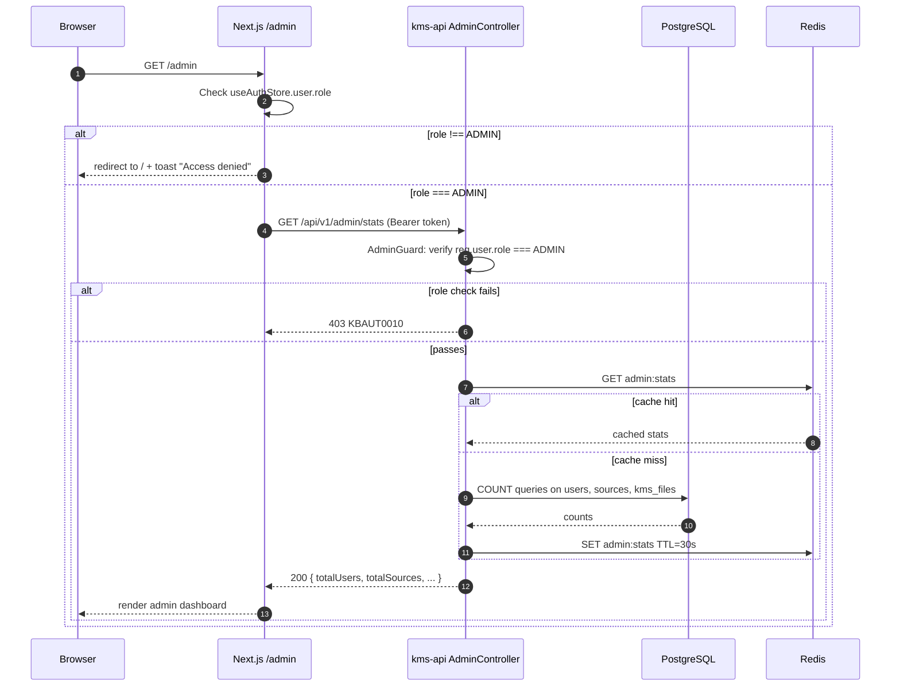

# PRD: Admin Dashboard with RBAC

## Status

`Draft`

**Created**: 2026-03-24
**Author**: Gaurav (Ved)
**Reviewer**: —

---

## Business Context

KMS currently has no way for operators to observe system-wide state: who has registered, which sources are connected across all users, whether scan and embedding jobs are healthy. Additionally, every authenticated user has equivalent access to every API endpoint — there is no privilege separation. Without an admin surface, diagnosing issues requires direct database queries and there is no safe path for support tasks. This feature adds a `role` field to the `User` model (USER | ADMIN), gates a new `/admin` page behind the ADMIN role, and surfaces system-wide metrics that help operators identify stuck pipelines, quota concerns, and onboarding blockers.

---

## User Stories

| As a... | I want to... | So that... |
|---------|-------------|-----------|
| Admin | View all registered users and their status | I can confirm onboarding is working and spot suspended accounts |
| Admin | See all sources across every user | I can identify OAuth failures or stale connections without querying the DB |
| Admin | View scan job history across users | I can diagnose stuck or failed scan jobs quickly |
| Admin | See the current embedding queue depth | I know whether the embed-worker is healthy or falling behind |
| Admin | Access the admin page without it being visible to regular users | The admin surface is not accidentally exposed |
| Regular user | Be redirected away from `/admin` | I cannot access data belonging to other users |

---

## Scope

**In scope:**
- New `/admin` page (Next.js App Router, server-side role check)
- `UserRole` enum already exists in the Prisma schema (`USER`, `ADMIN`, `SERVICE_ACCOUNT`) — no migration required; default is `USER`
- `AdminGuard` NestJS guard that checks `req.user.role === 'ADMIN'`; applied to all new admin endpoints
- Admin panel sections:
  - Users table: all users, filtered by status/role; columns: email, name, role, status, created, last login
  - Sources table: all sources across users; columns: user email, type, name, status, last scanned, file count
  - Scan job history: most recent 200 scan jobs across users; columns: user email, source name, type, status, started, finished, files found
  - Embedding queue depth: live count of PENDING + PROCESSING files from `kms_files` table
- JWT token must carry `role` claim; `AuthService.login()` must include `role` in the payload
- Frontend `useAuthStore` must store and expose `role` to gate the Admin nav link

**Out of scope:**
- User management (create, delete, ban users)
- Billing or quota management
- Per-user analytics or charting
- Audit log / event history
- Role assignment via UI (role changes via DB or seed only, for now)

---

## Functional Requirements

| ID | Requirement | Priority | Notes |
|----|-------------|----------|-------|
| FR-01 | `AdminGuard` rejects requests from non-ADMIN users with HTTP 403 and error code `KBAUT0010` | Must | Applied at controller level, not route level |
| FR-02 | `GET /admin/users` returns paginated list of all users (cursor-based, limit 50) with fields: id, email, firstName, lastName, role, status, createdAt, lastLoginAt | Must | Admin only |
| FR-03 | `GET /admin/sources` returns paginated list of all sources across users with fields: id, userId, userEmail, type, name, status, lastScannedAt, fileCount | Must | Admin only |
| FR-04 | `GET /admin/scan-jobs` returns the most recent 200 scan jobs across all users with fields: id, userId, userEmail, sourceId, sourceName, type, status, startedAt, finishedAt, filesFound | Must | Admin only |
| FR-05 | `GET /admin/stats` returns system-wide counters: totalUsers, totalSources, totalFiles, pendingEmbeds, processingEmbeds, failedFiles, queueDepth (PENDING + PROCESSING count from kms_files) | Must | Admin only |
| FR-06 | JWT payload must include `role` field; `JwtStrategy.validate()` must return it on `req.user` | Must | No schema change needed — UserRole enum already exists |
| FR-07 | Frontend `/admin` route checks `user.role === 'ADMIN'` client-side and redirects to `/` with a toast if not admin | Must | Server-side middleware check is the authoritative gate |
| FR-08 | Admin nav link in sidebar is only rendered when `user.role === 'ADMIN'` | Must | |
| FR-09 | Admin users table supports filtering by `status` and `role` via query params | Should | |
| FR-10 | Admin sources table supports filtering by `type` and `status` via query params | Should | |
| FR-11 | All admin list responses follow the existing cursor-pagination shape `{ data: [], nextCursor, total }` | Must | Consistent with `ListFilesResponseDto` pattern |
| FR-12 | Admin stats endpoint refreshes at most every 30 seconds (cache in Redis with TTL=30s) | Should | Avoids full-table scans on every page load |

---

## Non-Functional Requirements

| Concern | Requirement |
|---------|-------------|
| Security | All `/admin/*` endpoints return 403 (not 404) for non-admin users. Do not leak existence of admin API. |
| Performance | Stats endpoint p95 < 200 ms when cached; < 1 s cold (Redis TTL=30 s) |
| Scalability | Admin list endpoints support up to 10 000 users and 50 000 sources without full-table scans (indexed queries only) |
| Availability | Admin APIs share the kms-api availability SLA; no separate service |
| Data isolation | Admin endpoints never modify user data; read-only |

---

## Data Model Changes

No Prisma schema migration is required. The `UserRole` enum (`ADMIN`, `USER`, `SERVICE_ACCOUNT`) and `role` column on `users` already exist in `schema.prisma` (line 50). The `@@index([role])` index is also already defined.

The only code change needed is ensuring the JWT payload includes `role`:

```typescript
// In AuthService.login() / JwtStrategy.validate()
// Add to existing JWT payload:
{ sub: user.id, email: user.email, role: user.role }
```

---

## API Contract

| Method | Path | Auth | Description |
|--------|------|------|-------------|
| GET | `/api/v1/admin/stats` | JWT + ADMIN | System-wide counters (cached 30 s) |
| GET | `/api/v1/admin/users` | JWT + ADMIN | Paginated list of all users |
| GET | `/api/v1/admin/sources` | JWT + ADMIN | Paginated list of all sources across users |
| GET | `/api/v1/admin/scan-jobs` | JWT + ADMIN | Most recent 200 scan jobs across users |

Query params for list endpoints:
- `cursor` (string) — opaque cursor for next page
- `limit` (integer, 1–100, default 50)
- `status` (string, optional filter)
- `role` (string, optional filter — users endpoint only)
- `type` (string, optional filter — sources endpoint only)

---

## Flow Diagram



---

## Decisions Required

| # | Question | Options | Decision | ADR |
|---|---------|---------|----------|-----|
| 1 | Single `role` enum column vs separate `user_roles` table | Enum column (simple), separate table (flexible) | Enum column — KMS only needs USER/ADMIN | ADR-0005 |
| 2 | Cache admin stats in Redis or PostgreSQL materialized view | Redis TTL, materialized view | Redis TTL=30s (already in stack) | — |

---

## ADRs Written

- [x] [ADR-0005: Admin RBAC Approach](../architecture/decisions/0005-admin-rbac-approach.md)

---

## Sequence Diagrams Written

- [ ] [01 — Admin authentication and guard flow](../architecture/sequence-diagrams/01-admin-guard-flow.md)

---

## Feature Guide Written

- [ ] [FOR-admin-dashboard.md](../development/FOR-admin-dashboard.md)

---

## Testing Plan

| Test Type | Scope | Coverage Target |
|-----------|-------|----------------|
| Unit | `AdminGuard` — allows ADMIN, rejects USER and SERVICE_ACCOUNT | 100% of guard branches |
| Unit | `AdminService.getStats()` — returns correct counts, cache hit and miss paths | 80% |
| Unit | `AdminService.listUsers()` / `listSources()` / `listScanJobs()` — pagination logic | 80% |
| Integration | `GET /admin/stats` with valid ADMIN JWT → 200; with USER JWT → 403; with no token → 401 | All three cases |
| Integration | `GET /admin/users` cursor pagination — page 1 then page 2 with nextCursor | Key path |
| E2E | Log in as ADMIN → navigate to `/admin` → see user count > 0 | Happy path |
| E2E | Log in as regular USER → navigate to `/admin` → redirected to dashboard | Access gate |
| Regression | Non-admin user cannot reach any `/admin/*` endpoint | All four endpoints |

---

## Rollout

| Item | Value |
|------|-------|
| Feature flag | `.kms/config.json` → `features.adminDashboard.enabled` |
| Requires migration | No — `role` column and `UserRole` enum already exist in schema |
| Requires seed data | Yes — at least one user must have `role = ADMIN`; add to `prisma/seed.ts` |
| Dependencies | M01 (Authentication) must be fully shipped |
| Rollback plan | Remove `AdminModule` from `AppModule` imports; `/admin` page returns 404 |

---

## Linked Resources

- Architecture: [ADR-0005: Admin RBAC Approach](../architecture/decisions/0005-admin-rbac-approach.md)
- Related PRD: [PRD-M01-authentication.md](PRD-M01-authentication.md)
- Related PRD: [PRD-M11-web-ui.md](PRD-M11-web-ui.md) — Admin page stub referenced in FR-43
