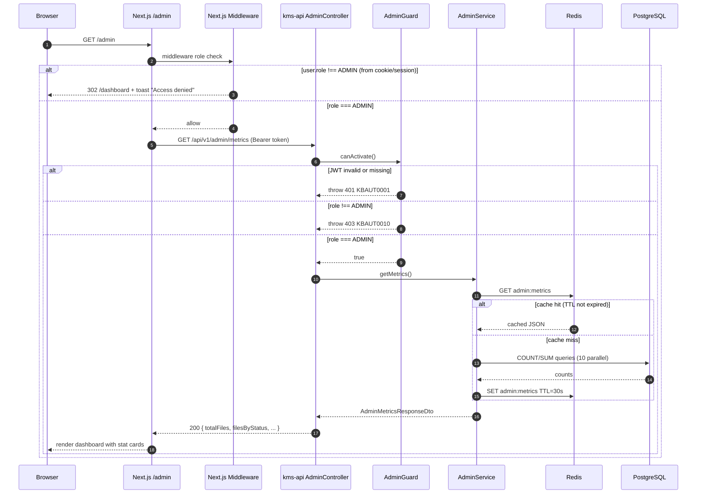
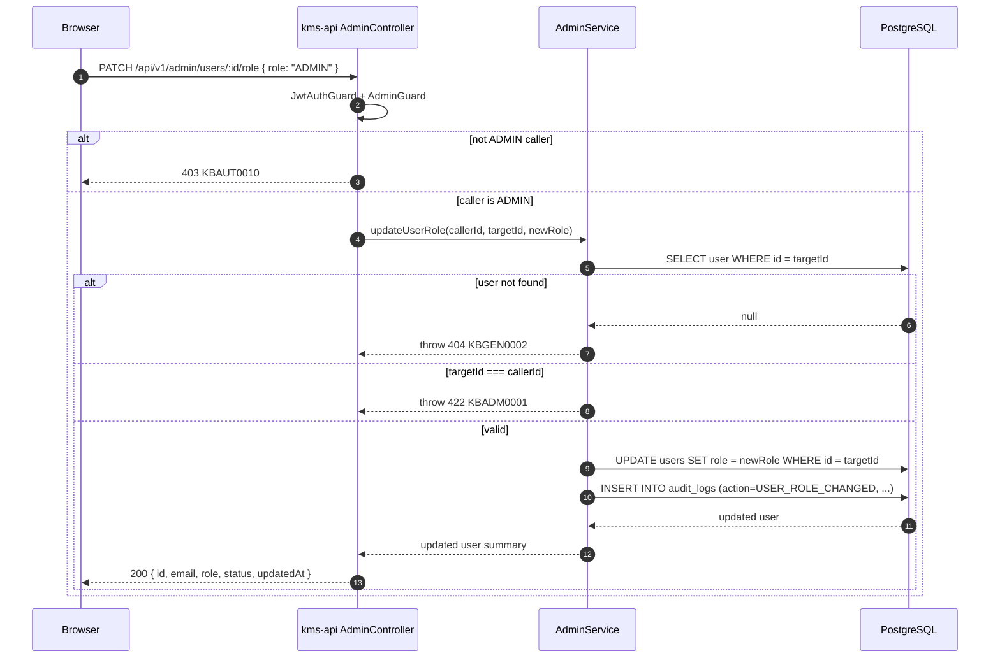

# PRD: Admin Dashboard with RBAC

## Status

`Draft`

**Created**: 2026-03-24
**Updated**: 2026-03-27
**Author**: Gaurav (Ved)
**Reviewer**: —

---

## Business Context

KMS currently has no way for operators to observe system-wide state: who has registered, which sources are connected across all users, whether scan and embedding jobs are healthy. Every authenticated user has equivalent access to every API endpoint — there is no privilege separation. Without an admin surface, diagnosing issues requires direct database queries, and there is no safe path for support tasks such as role changes.

This feature adds a protected `/admin` section to the `kms-api` (the `UserRole` enum and `role` column on `users` already exist in the schema), gates it behind a custom `AdminGuard`, and exposes four endpoint groups: system metrics, user management, user role mutation, and per-source summary. The companion `/admin` page in the Next.js frontend renders these APIs for designated operators.

---

## User Stories

| As a...      | I want to...                                                         | So that...                                                                          |
|--------------|----------------------------------------------------------------------|-------------------------------------------------------------------------------------|
| Admin        | See total files indexed by status (pending, processing, indexed, failed) | I can instantly tell whether the embedding pipeline is healthy or stuck           |
| Admin        | See files added in the last 7 and 30 days                            | I can track indexing velocity and detect onboarding spikes                          |
| Admin        | See total storage used across all users                              | I can monitor disk/quota pressure before it becomes a problem                       |
| Admin        | See the current embedding queue depth                                | I know whether the embed-worker is falling behind                                   |
| Admin        | See per-source stats: source name, type, file count, last sync       | I can identify stale or broken connections without querying the database            |
| Admin        | Browse all registered users with email, role, status, and created_at | I can confirm onboarding is working and spot suspended accounts                    |
| Admin        | Change a user's role (USER ↔ ADMIN)                                  | I can promote a new operator or revoke admin access without direct DB access        |
| Admin        | View scan job history across all users                               | I can diagnose stuck or failed scan jobs quickly                                    |
| Regular user | Be redirected away from `/admin` with an "Access denied" notice      | I cannot access data belonging to other users                                       |

---

## Scope

**In scope:**

- `AdminModule` in `kms-api` — controller, service, guard, and DTOs
- `AdminGuard` (`JwtAuthGuard` must run first) — rejects non-ADMIN with HTTP 403 / `KBAUT0010`
- `GET /api/v1/admin/metrics` — aggregate stats with storage bytes and time-windowed file counts
- `GET /api/v1/admin/stats` — alias for `/metrics` (already implemented; remains for backward compatibility)
- `GET /api/v1/admin/users` — cursor-paginated list of all users
- `PATCH /api/v1/admin/users/:id/role` — change a user's role (ADMIN write action)
- `GET /api/v1/admin/sources/summary` — per-source aggregate: name, type, file count, last sync
- `GET /api/v1/admin/sources` — cursor-paginated flat list of all sources (already implemented)
- `GET /api/v1/admin/scan-jobs` — most recent 200 scan jobs (already implemented)
- JWT payload carries `role` claim; `JwtStrategy.validate()` already returns it on `req.user`
- Frontend `/admin` page: stat cards + users table + role-change modal + sources summary table
- Admin nav link in sidebar, visible only when `user.role === 'ADMIN'`
- `AuditLog` record written on every `PATCH /admin/users/:id/role` call

**Out of scope:**

- Creating or deleting user accounts via UI
- Billing, quota management, or usage cost reporting
- Per-user analytics, charting, or trend graphs
- Email notifications when jobs fail
- Real-time WebSocket / SSE push for live queue depth
- Bulk role assignment
- Fine-grained permissions beyond USER / ADMIN (separate `user_roles` table — see ADR-0005)

---

## Functional Requirements

| ID    | Requirement                                                                                                                                                                  | Priority | Notes                                                                 |
|-------|------------------------------------------------------------------------------------------------------------------------------------------------------------------------------|----------|-----------------------------------------------------------------------|
| FR-01 | `AdminGuard` must reject requests from non-ADMIN users with HTTP 403 and error code `KBAUT0010`                                                                              | Must     | Guard is applied at controller class level, not per-route             |
| FR-02 | `GET /admin/metrics` returns: `totalFiles`, `filesByStatus` (map of FileStatus → count), `filesLast7Days`, `filesLast30Days`, `totalStorageBytes`, `pendingEmbeds`, `processingEmbeds`, `failedFiles`, `totalUsers`, `totalSources` | Must | See API Contract section for exact shape |
| FR-03 | `GET /admin/stats` continues to work and returns the subset already implemented (`totalUsers`, `totalSources`, `totalFiles`, `pendingEmbeds`, `processingEmbeds`, `failedFiles`) — no breaking change | Must | Backward compat for existing clients |
| FR-04 | `GET /admin/users` returns cursor-paginated list of all users with fields: `id`, `email`, `firstName`, `lastName`, `role`, `status`, `createdAt`, `lastLoginAt`              | Must     | Page size default 50, max 100                                         |
| FR-05 | `GET /admin/users` supports optional query filters: `status` (UserStatus enum), `role` (UserRole enum)                                                                       | Should   | Applied as `WHERE` clause additions                                   |
| FR-06 | `PATCH /admin/users/:id/role` accepts `{ role: UserRole }` body, updates the user's `role` column, writes an `AuditLog` record, and returns the updated user summary          | Must     | Body validated by `UpdateUserRoleDto`; cannot change own role         |
| FR-07 | `PATCH /admin/users/:id/role` must prevent an admin from demoting their own account (returns HTTP 422 with code `KBADM0001`)                                                  | Must     | Prevents accidental lockout                                           |
| FR-08 | `GET /admin/sources/summary` returns one row per source across all users: `id`, `userId`, `userEmail`, `type`, `name`, `status`, `fileCount`, `lastScannedAt`, `lastSyncedAt` | Must     | Not paginated — full list up to a hard limit of 500 rows              |
| FR-09 | `GET /admin/sources` continues to return cursor-paginated list (already implemented)                                                                                          | Must     | No change to existing behavior                                        |
| FR-10 | `GET /admin/scan-jobs` continues to return the most recent 200 scan jobs (already implemented)                                                                                | Must     | No change to existing behavior                                        |
| FR-11 | All admin list responses follow the cursor-pagination shape `{ data: T[], nextCursor: string | null, total: number }`                                                         | Must     | Consistent with `ListFilesResponseDto` pattern in files module        |
| FR-12 | `GET /admin/metrics` stats are cached in Redis with TTL=30 s under key `admin:metrics`; cache is invalidated on any `PATCH /admin/users/:id/role` call                       | Should   | Avoids full-table scans on every page load; cold path < 1 s          |
| FR-13 | Frontend `/admin` route performs a server-side middleware role check; non-admin users are redirected to `/dashboard` with a toast "Access denied"                             | Must     | Authoritative gate is the API guard; UI check is defence-in-depth    |
| FR-14 | Admin nav link in the sidebar is only rendered when `user.role === 'ADMIN'` (from `useAuthStore`)                                                                             | Must     |                                                                       |
| FR-15 | `AuditLog` record for role changes must include: `action='USER_ROLE_CHANGED'`, `resource='users'`, `resourceId=userId`, `oldValue`, `newValue`, `ipAddress`, `traceId`       | Must     | Required for accountability; uses existing `AuditLog` model          |

---

## Non-Functional Requirements

| Concern        | Requirement                                                                                                                   |
|----------------|-------------------------------------------------------------------------------------------------------------------------------|
| Security       | All `/admin/*` endpoints return 403 (not 404) for non-admin authenticated users; 401 for unauthenticated requests            |
| Security       | `PATCH /admin/users/:id/role` requires ADMIN role and writes an immutable `AuditLog` record; the log cannot be deleted via API |
| Security       | Response payloads never include `passwordHash`, `encryptedTokens`, or raw PII beyond email                                   |
| Performance    | `GET /admin/metrics` p95 < 200 ms when Redis-cached; p95 < 1 s on cold path                                                  |
| Performance    | `GET /admin/users` and `GET /admin/sources` must use indexed queries only (no sequential scans) for tables up to 10 000 rows  |
| Scalability    | All list endpoints support up to 10 000 users and 50 000 sources without full-table scans                                     |
| Availability   | Admin APIs share the `kms-api` availability SLA; no separate service required                                                 |
| Data integrity | Admin list endpoints are read-only except for `PATCH /admin/users/:id/role`; no other mutation operations                     |
| Observability  | Every admin API call emits a structured Pino log event with `event`, `userId`, and relevant context fields                    |
| Observability  | Every service method is wrapped in an OTel span via the `@Trace()` decorator                                                  |

---

## Data Model Changes

No new Prisma schema migration is required for the core feature. All necessary tables and columns already exist.

The following columns are used by the new endpoints:

**`users` table** (already exists):
- `id`, `email`, `first_name`, `last_name`, `role` (UserRole enum), `status` (UserStatus enum), `created_at`, `last_login_at`
- Indexes: `@@index([role])`, `@@index([status])`, `@@index([createdAt])` — all present in schema

**`kms_files` table** (already exists):
- `status` (FileStatus enum), `size_bytes` (BigInt), `created_at`
- Indexes: `@@index([userId, status])` — present; a composite `(status, created_at)` index would benefit time-windowed counts (see Decisions Required)

**`kms_sources` table** (already exists):
- `id`, `user_id`, `type`, `name`, `status`, `file_count`, `last_scanned_at`, `last_synced_at`
- Index: `@@index([userId, status])` — present

**`audit_logs` table** (already exists):
- `user_id`, `action`, `resource`, `resource_id`, `old_value`, `new_value`, `ip_address`, `trace_id`
- Used to record role-change events; no schema change needed

**New error code** — add to `error-codes/index.ts`:
```typescript
// In AUT error codes section (or new ADM domain):
ADMIN_SELF_ROLE_CHANGE: {
  code: 'KBADM0001',
  message: 'Admin cannot change their own role',
  httpStatus: 422,
}
```

---

## API Contract

### Overview

| Method | Path                            | Auth           | Description                                                    |
|--------|---------------------------------|----------------|----------------------------------------------------------------|
| GET    | `/api/v1/admin/metrics`         | JWT + ADMIN    | System-wide aggregate stats with storage and time-window counts |
| GET    | `/api/v1/admin/stats`           | JWT + ADMIN    | Subset stats (backward-compat alias)                           |
| GET    | `/api/v1/admin/users`           | JWT + ADMIN    | Cursor-paginated list of all users                             |
| PATCH  | `/api/v1/admin/users/:id/role`  | JWT + ADMIN    | Change a single user's role                                    |
| GET    | `/api/v1/admin/sources/summary` | JWT + ADMIN    | Per-source aggregate (flat list, max 500)                      |
| GET    | `/api/v1/admin/sources`         | JWT + ADMIN    | Cursor-paginated list of all sources                           |
| GET    | `/api/v1/admin/scan-jobs`       | JWT + ADMIN    | Most recent 200 scan jobs across all users                     |

---

### `GET /api/v1/admin/metrics`

**Query params:** none

**Response 200:**
```jsonc
{
  "totalFiles": 1240,
  "filesByStatus": {
    "PENDING": 45,
    "PROCESSING": 12,
    "INDEXED": 1150,
    "ERROR": 23,
    "UNSUPPORTED": 8,
    "DELETED": 2
  },
  "filesLast7Days": 87,
  "filesLast30Days": 310,
  "totalStorageBytes": 4831838208,
  "pendingEmbeds": 45,
  "processingEmbeds": 12,
  "failedFiles": 23,
  "totalUsers": 34,
  "totalSources": 61
}
```

**Notes:**
- `totalStorageBytes` is `SUM(size_bytes)` over all non-deleted files in `kms_files`.
- `filesLast7Days` / `filesLast30Days` count `kms_files` rows where `created_at >= NOW() - INTERVAL '7 days'` / `'30 days'`.
- `filesByStatus` is computed with a `GROUP BY status` query.
- Response is cached in Redis under key `admin:metrics` with TTL=30 s.

---

### `GET /api/v1/admin/users`

**Query params:**

| Param    | Type       | Default | Description                                          |
|----------|------------|---------|------------------------------------------------------|
| `cursor` | string     | —       | Opaque cursor from previous page's `nextCursor`      |
| `limit`  | integer    | 50      | Page size, 1–100                                     |
| `status` | UserStatus | —       | Optional filter: `ACTIVE`, `INACTIVE`, `SUSPENDED`, `PENDING_VERIFICATION` |
| `role`   | UserRole   | —       | Optional filter: `USER`, `ADMIN`, `SERVICE_ACCOUNT`  |

**Response 200:**
```jsonc
{
  "data": [
    {
      "id": "uuid",
      "email": "alice@example.com",
      "firstName": "Alice",
      "lastName": "Smith",
      "role": "USER",
      "status": "ACTIVE",
      "createdAt": "2025-01-01T00:00:00.000Z",
      "lastLoginAt": "2025-03-01T12:00:00.000Z"
    }
  ],
  "nextCursor": "uuid-of-last-item-or-null",
  "total": 34
}
```

**Notes:**
- `passwordHash`, `failedLoginCount`, `lockedUntil`, and `metadata` are excluded from the response.
- Ordered by `createdAt DESC`.

---

### `PATCH /api/v1/admin/users/:id/role`

**Path param:** `id` — UUID of the target user.

**Request body:**
```jsonc
{
  "role": "ADMIN"  // UserRole: "USER" | "ADMIN" | "SERVICE_ACCOUNT"
}
```

**Response 200:**
```jsonc
{
  "id": "uuid",
  "email": "alice@example.com",
  "role": "ADMIN",
  "status": "ACTIVE",
  "updatedAt": "2026-03-27T10:00:00.000Z"
}
```

**Error responses:**

| Status | Code        | Condition                                     |
|--------|-------------|-----------------------------------------------|
| 400    | `KBGEN0001` | Body fails validation (e.g. invalid role value) |
| 403    | `KBAUT0010` | Caller is not ADMIN                           |
| 404    | `KBGEN0002` | Target user not found                         |
| 422    | `KBADM0001` | Admin attempting to change their own role     |

**Side effects:**
- Updates `users.role` for the target user.
- Writes one `AuditLog` row: `action='USER_ROLE_CHANGED'`, `resource='users'`, `resourceId=targetUserId`, `oldValue={ role: 'USER' }`, `newValue={ role: 'ADMIN' }`.

---

### `GET /api/v1/admin/sources/summary`

**Query params:** none (no pagination — hard limit 500 rows)

**Response 200:**
```jsonc
{
  "data": [
    {
      "id": "uuid",
      "userId": "uuid",
      "userEmail": "alice@example.com",
      "type": "GOOGLE_DRIVE",
      "name": "Alice's Drive",
      "status": "CONNECTED",
      "fileCount": 312,
      "lastScannedAt": "2026-03-26T08:00:00.000Z",
      "lastSyncedAt": "2026-03-26T08:05:00.000Z"
    }
  ],
  "total": 61
}
```

**Notes:**
- Ordered by `fileCount DESC` so the most-active sources appear first.
- `userEmail` is joined from `users` table via a batch lookup (no N+1).
- Hard cap of 500 rows; if `total > 500`, the caller sees the top 500 by `fileCount`.

---

### `GET /api/v1/admin/sources` (existing)

Cursor-paginated. Same shape as `AdminListResponseDto<AdminSourceItemDto>`. See existing implementation in `admin.service.ts`. No changes in this PRD.

---

### `GET /api/v1/admin/scan-jobs` (existing)

Fixed limit of 200 most-recent scan jobs. No changes in this PRD.

---

## DB Queries

All queries target `kms-api`'s PostgreSQL via Prisma. No raw SQL is required.

### `GET /admin/metrics` — aggregate counters

```typescript
// Run in parallel via Promise.all

// 1. Total users
prisma.user.count()

// 2. Total sources
prisma.kmsSource.count()

// 3. Total files (non-deleted)
prisma.kmsFile.count({ where: { deletedAt: null } })

// 4. Files by status (GROUP BY status equivalent using Promise.all over each status)
// OR a single Prisma $queryRaw for efficiency:
// SELECT status, COUNT(*) FROM kms_files WHERE deleted_at IS NULL GROUP BY status

// 5. Total storage bytes
// Prisma aggregate:
prisma.kmsFile.aggregate({
  _sum: { sizeBytes: true },
  where: { deletedAt: null },
})

// 6. Files added in last 7 days
prisma.kmsFile.count({
  where: { createdAt: { gte: subDays(new Date(), 7) } }
})

// 7. Files added in last 30 days
prisma.kmsFile.count({
  where: { createdAt: { gte: subDays(new Date(), 30) } }
})

// 8. Pending embeds (FileStatus.PENDING)
prisma.kmsFile.count({ where: { status: 'PENDING' } })

// 9. Processing embeds (FileStatus.PROCESSING)
prisma.kmsFile.count({ where: { status: 'PROCESSING' } })

// 10. Failed files (FileStatus.ERROR)
prisma.kmsFile.count({ where: { status: 'ERROR' } })
```

**Index utilisation:**
- Queries 3–10 all use `@@index([userId, status])` (partial scan for status filter) and `@@index([createdAt])` for time-window counts.
- Query 5 (`SUM(size_bytes)`) requires a full index scan on non-deleted rows; this is acceptable for the 30 s cache TTL.

---

### `GET /admin/users` — paginated user list

```typescript
// Total count (possibly with optional filter)
prisma.user.count({ where: filters })

// Cursor page
prisma.user.findMany({
  take: limit + 1,
  ...(cursor ? { cursor: { id: cursor }, skip: 1 } : {}),
  where: filters,  // { status?, role? }
  orderBy: { createdAt: 'desc' },
  select: {
    id, email, firstName, lastName, role, status, createdAt, lastLoginAt
  }
})
```

**Index utilisation:** `@@index([role])`, `@@index([status])`, `@@index([createdAt])` — all present.

---

### `PATCH /admin/users/:id/role` — role update + audit

```typescript
// 1. Find target user
prisma.user.findUniqueOrThrow({ where: { id: targetId } })

// 2. Guard: if targetId === callerId → throw KBADM0001

// 3. Update role
prisma.user.update({
  where: { id: targetId },
  data: { role: newRole },
  select: { id, email, role, status, updatedAt }
})

// 4. Write audit log (in same request, no transaction needed — audit is best-effort)
prisma.auditLog.create({
  data: {
    userId: callerId,
    action: 'USER_ROLE_CHANGED',
    resource: 'users',
    resourceId: targetId,
    oldValue: { role: oldRole },
    newValue: { role: newRole },
    ipAddress: req.ip,
    traceId: span.spanContext().traceId,
  }
})
```

---

### `GET /admin/sources/summary` — per-source aggregate

```typescript
// All sources ordered by fileCount desc, limit 500
const sources = await prisma.kmsSource.findMany({
  take: 500,
  orderBy: { fileCount: 'desc' },
  select: {
    id, userId, type, name, status, fileCount, lastScannedAt, lastSyncedAt
  }
})

// Batch fetch user emails (no N+1)
const userIds = [...new Set(sources.map(s => s.userId))]
const emailMap = await prisma.user
  .findMany({ where: { id: { in: userIds } }, select: { id, email } })
  .then(rows => new Map(rows.map(u => [u.id, u.email])))
```

**Index utilisation:** `@@index([userId])` on `kms_sources`; order by `file_count` is a sequential sort (acceptable for ≤ 500 rows).

---

## Security Requirements

### Authentication and authorisation

- Every `/admin/*` endpoint requires a valid JWT access token (`JwtAuthGuard` runs first).
- `AdminGuard` checks `req.user.role === UserRole.ADMIN` — a single comparison against the value already decoded from the JWT; no extra DB query.
- Non-ADMIN authenticated users receive HTTP 403 with `{ code: 'KBAUT0010', message: 'Admin access required' }`.
- Unauthenticated requests receive HTTP 401 with `{ code: 'KBAUT0001', message: 'Authentication required' }`.
- The existence of the `/admin` API must not be obscured (security by obscurity is not a defence), but 403 is returned — not 404 — so the error code does not reveal whether a resource exists.

### Data exposure policy

The following fields must **never** appear in any admin API response:

| Field              | Table        | Reason                                        |
|--------------------|--------------|-----------------------------------------------|
| `passwordHash`     | `users`      | Password credential                           |
| `encryptedTokens`  | `kms_sources`| OAuth refresh tokens                          |
| `configJson`       | `kms_sources`| May contain filesystem paths or API keys      |
| `tokenHash`        | `api_keys`   | Key credential hash                           |
| `metadata` (raw)   | `users`      | May contain app-internal session state or PII |

Admin list endpoints use explicit Prisma `select: {}` blocks — never `findMany()` without a select — to prevent accidental field inclusion.

### Write operations (role change)

- `PATCH /admin/users/:id/role` is the only admin mutation. It is protected by both `JwtAuthGuard` and `AdminGuard`.
- An admin cannot demote their own account to avoid accidental lockout (FR-07 / `KBADM0001`).
- Every successful role change is recorded in `audit_logs` with `oldValue` and `newValue` so the change is traceable even if the target user's role is later changed again.
- `audit_logs` rows have no `DELETE` endpoint; records are append-only.

### Rate limiting (future)

No rate limiting is in scope for this PRD. The endpoints are already behind `JwtAuthGuard + AdminGuard`, which limits access to a small set of trusted operators. If the system is later exposed to a shared-admin model, per-IP or per-user rate limiting should be added via a NestJS `ThrottlerGuard`.

---

## Flow Diagram





---

## Decisions Required

| #  | Question                                                                        | Options                                                     | Decision                              | ADR       |
|----|---------------------------------------------------------------------------------|-------------------------------------------------------------|---------------------------------------|-----------|
| 1  | Single `role` enum column vs separate `user_roles` table                        | Enum column (simple), separate table (flexible)             | Enum column — KMS only needs USER/ADMIN | ADR-0005  |
| 2  | Cache admin metrics in Redis or PostgreSQL materialized view                    | Redis TTL=30 s, materialized view, no cache                 | Redis TTL=30 s (already in stack)     | —         |
| 3  | Add composite index `(status, created_at)` on `kms_files` for time-window counts | Add index, use existing `(userId, status)` + filter on createdAt | Defer — evaluate after load testing | —         |
| 4  | `GET /admin/sources/summary` — hard limit 500 or full pagination                | Hard limit, cursor pagination                               | Hard limit 500 ordered by fileCount desc | —       |

---

## ADRs Written

- [x] [ADR-0005: Admin RBAC Approach](../architecture/decisions/0005-admin-rbac-approach.md)

---

## Sequence Diagrams Written

- [ ] [01 — Admin authentication and guard flow](../architecture/sequence-diagrams/01-admin-guard-flow.md)
- [ ] [02 — Admin role change with audit log](../architecture/sequence-diagrams/02-admin-role-change.md)

---

## Feature Guide Written

- [ ] [FOR-admin-dashboard.md](../development/FOR-admin-dashboard.md)

---

## Testing Plan

| Test Type   | Scope                                                                                                    | Coverage Target              |
|-------------|----------------------------------------------------------------------------------------------------------|------------------------------|
| Unit        | `AdminGuard` — allows ADMIN, rejects USER, SERVICE_ACCOUNT, unauthenticated                              | 100% of guard branches       |
| Unit        | `AdminService.getMetrics()` — all counters, `filesLast7Days`, `filesLast30Days`, `totalStorageBytes`     | 80%                          |
| Unit        | `AdminService.getUsers()` — pagination, cursor, optional status/role filters                             | 80%                          |
| Unit        | `AdminService.updateUserRole()` — happy path, user not found, self-change guard                          | 100% of branches             |
| Unit        | `AdminService.getSourcesSummary()` — correct shape, userEmail join, 500-row cap                          | 80%                          |
| Unit        | `AdminService.getScanJobs()` — existing; extend to cover empty-list path                                 | 80%                          |
| Integration | `GET /admin/metrics` with valid ADMIN JWT → 200; with USER JWT → 403; with no token → 401               | All three cases              |
| Integration | `GET /admin/users?role=ADMIN` — only returns ADMIN users                                                 | Filter path                  |
| Integration | `PATCH /admin/users/:id/role` happy path → 200 + audit log written                                      | Happy path                   |
| Integration | `PATCH /admin/users/:id/role` self-change → 422 KBADM0001                                               | Self-demote guard            |
| Integration | `PATCH /admin/users/:id/role` unknown userId → 404                                                       | Not-found path               |
| Integration | `GET /admin/sources/summary` → returns userEmail joined correctly                                        | Join path                    |
| Integration | Cursor pagination: `GET /admin/users` page 1 → extract `nextCursor` → page 2 → `nextCursor` null        | Pagination chain             |
| E2E         | Log in as ADMIN → navigate to `/admin` → see user count > 0 and storage > 0                             | Happy path                   |
| E2E         | Log in as regular USER → navigate to `/admin` → redirected to dashboard                                 | Access gate                  |
| Regression  | Non-admin user cannot reach any `/admin/*` endpoint (all four existing + two new)                        | All six endpoints            |

---

## Rollout

| Item                | Value                                                                                     |
|---------------------|-------------------------------------------------------------------------------------------|
| Feature flag        | `.kms/config.json` → `features.adminDashboard.enabled`                                   |
| Requires migration  | No — `role` column and `UserRole` enum already exist in schema; `audit_logs` table exists |
| Requires seed data  | Yes — at least one user must have `role = ADMIN`; add to `prisma/seed.ts` or run: `UPDATE users SET role = 'ADMIN' WHERE email = 'admin@example.com';` |
| New error code      | `KBADM0001` must be added to `src/errors/error-codes/index.ts`                           |
| Dependencies        | M01 (Authentication) must be fully shipped; Redis must be available for metrics cache     |
| Rollback plan       | Remove `AdminModule` from `AppModule` imports + disable feature flag; `/admin` page returns 404 |

---

## Implementation Status

The following parts are **already implemented** (as of 2026-03-27):

| Component                             | Status     | Location                                              |
|---------------------------------------|------------|-------------------------------------------------------|
| `AdminModule`                         | Done       | `kms-api/src/modules/admin/admin.module.ts`           |
| `AdminController` (stats, users, sources, scan-jobs) | Done | `kms-api/src/modules/admin/admin.controller.ts` |
| `AdminService` (getStats, getUsers, getSources, getScanJobs) | Done | `kms-api/src/modules/admin/admin.service.ts` |
| `AdminGuard` (ADMIN role check)       | Done       | `kms-api/src/modules/admin/admin.guard.ts`            |
| `AdminStatsResponseDto`               | Done       | `kms-api/src/modules/admin/dto/admin-stats-response.dto.ts` |
| `AdminListResponseDto` + item DTOs    | Done       | `kms-api/src/modules/admin/dto/admin-list-response.dto.ts` |
| `AdminUsersQueryDto`                  | Done       | `kms-api/src/modules/admin/dto/admin-users-query.dto.ts` |
| `AdminSourcesQueryDto`                | Done       | `kms-api/src/modules/admin/dto/admin-sources-query.dto.ts` |
| Unit tests: guard + service + controller | Done    | `*.spec.ts` in `admin/`                               |
| Error code `KBAUT0010`                | Done       | `src/errors/error-codes/index.ts`                     |
| ADR-0005 (RBAC approach)              | Done       | `docs/architecture/decisions/0005-admin-rbac-approach.md` |

The following are **not yet implemented** and are the primary deliverables of this PRD:

| Component                                        | Status  |
|--------------------------------------------------|---------|
| `GET /admin/metrics` (extended stats with storage + time windows) | Not started |
| `PATCH /admin/users/:id/role` endpoint + service method | Not started |
| `GET /admin/sources/summary` endpoint + service method | Not started |
| `UpdateUserRoleDto`                              | Not started |
| `AdminMetricsResponseDto`                        | Not started |
| Error code `KBADM0001`                           | Not started |
| Redis caching for `getMetrics()`                 | Not started |
| `AuditLog` write on role change                  | Not started |
| Frontend `/admin` page (stat cards, role-change modal) | Not started |
| Admin nav link visibility gating                 | Not started |

---

## Linked Resources

- Architecture: [ADR-0005: Admin RBAC Approach](../architecture/decisions/0005-admin-rbac-approach.md)
- Related PRD: [PRD-M01-authentication.md](PRD-M01-authentication.md)
- Related PRD: [PRD-M11-web-ui.md](PRD-M11-web-ui.md) — Admin page stub referenced in FR-43
