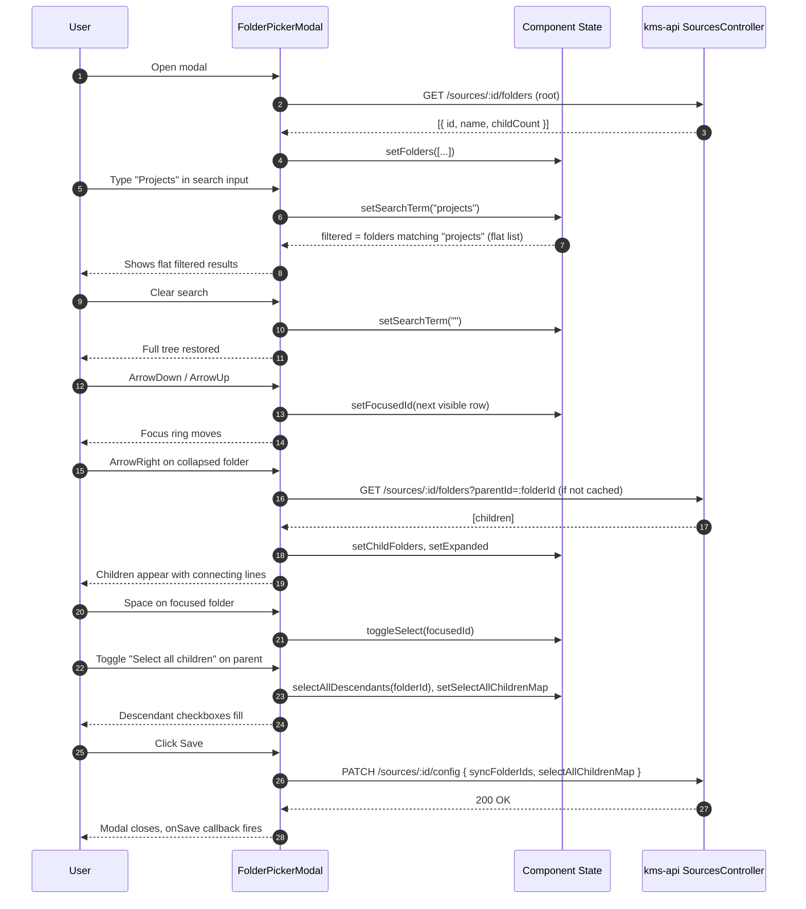

# PRD: Nested Folder Tree in Drive Folder Picker

## Status

`Draft`

**Created**: 2026-03-24
**Author**: Gaurav (Ved)
**Reviewer**: —

---

## Business Context

The `FolderPickerModal` already renders a basic tree of Google Drive folders with lazy-loaded children and a single level of CSS indentation (`ml-6`). However, users who have deeply nested or large Drive hierarchies find it difficult to navigate: there is no breadcrumb showing the current context, no way to filter folders by name, no indication of which folders are already being synced via an ancestor selection, and no keyboard navigation for power users. As KMS is adopted by users with complex Drive structures, the inability to efficiently pick sync folders becomes a meaningful onboarding friction point. This feature upgrades `FolderPickerModal` into a production-quality tree picker with search, keyboard navigation, proper connecting-line indentation, "select all children" propagation, and a selected-path summary.

---

## User Stories

| As a... | I want to... | So that... |
|---------|-------------|-----------|
| User | See clear visual indentation with connecting lines in the folder tree | I can instantly understand the depth and parent/child relationships |
| User | Search for a folder by name | I can find a deeply nested folder without manually expanding every level |
| User | Select a parent folder and have all children pre-selected | I don't have to manually select 20 subfolders one by one |
| User | See the full path (e.g. My Drive > Projects > 2026) for each selected folder | I know exactly which folder I've selected before saving |
| User | Navigate the tree with arrow keys and toggle selection with spacebar | I can work efficiently without reaching for the mouse |
| User | See which folders are inherited-selected (covered by an ancestor selection) | I understand the effective sync scope |

---

## Scope

**In scope:**
- Visual connecting lines between parent and child folders (vertical guide rail + horizontal connector at each node)
- "Select all children" toggle when selecting a parent: automatically selects all already-loaded child IDs; flags parent as `selectAllChildren: true` so the backend can apply recursive selection
- Search/filter input at the top of the modal: client-side filtering on loaded folder names; clears to show full tree
- Full path display in the selected-folders summary (e.g. "Projects > 2026 > Q1" — 3 folders selected")
- Keyboard navigation: Up/Down arrow keys move focus between visible rows; Right/Left expand/collapse; Space toggles selection; Enter confirms
- Inherited-selection indicator: folders whose ancestor is selected render with a faded/dimmed checkbox and a tooltip "Covered by parent selection"
- Breadcrumb bar showing the path to the currently focused folder (updates on expand/navigate)

**Out of scope:**
- Sync status per folder (how many files synced)
- Quota or storage usage display per folder
- Drag-and-drop reordering
- Pagination of folder children (children already loaded lazily on expand; no limit changes)
- Server-side search (client-side filtering on loaded nodes only for MVP)

---

## Functional Requirements

| ID | Requirement | Priority | Notes |
|----|-------------|----------|-------|
| FR-01 | Each folder row renders a vertical guide rail on the left that aligns with its parent's row, and a short horizontal connector to the folder icon | Must | Replaces current `ml-6 border-l` CSS approach with a proper SVG or CSS grid-based connector |
| FR-02 | Search input field appears at the top of the folder tree area; typing filters visible folder names (case-insensitive substring match on loaded nodes) | Must | Does not trigger new API calls; filters in-memory |
| FR-03 | When search term is active, all folders matching the term are shown flat (tree structure hidden); clearing the input restores the full tree | Must | |
| FR-04 | When a folder is selected, a "Select all children" checkbox/toggle appears inline in the folder row; toggling it marks all loaded descendants as selected and sends `selectAllChildren: true` flag to backend for that folder ID | Must | Only shown for folders with `childCount > 0` |
| FR-05 | The selected-folder summary text (currently "N folders selected") expands on click/hover to show a list of full paths for each selected folder, e.g. `My Drive > Work > Projects` | Must | Full path must be computed from the `DriveFolder` tree in local state |
| FR-06 | Keyboard: `ArrowDown` / `ArrowUp` moves focus between visible (non-collapsed) rows | Must | Visible rows only — collapsed children are skipped |
| FR-07 | Keyboard: `ArrowRight` expands a collapsed folder; `ArrowLeft` collapses an expanded folder | Must | |
| FR-08 | Keyboard: `Space` toggles selection on the focused folder | Must | |
| FR-09 | Keyboard: `Enter` in the modal triggers Save (same as clicking the Save button) | Should | |
| FR-10 | Folders whose ancestor is already selected render with a visually dimmed checkbox and a tooltip: "Covered by parent — this folder will be synced via [parent name]" | Should | Computed from `selected` set by walking the ancestor path |
| FR-11 | A breadcrumb bar at the top of the folder list shows the path to the most recently expanded folder: "My Drive > Work > Projects" | Should | Updates on each expand action |
| FR-12 | The `onSave` callback passes `{ folderIds: string[], selectAllChildrenMap: Record<string, boolean> }` so the backend can apply recursive selection for marked folders | Must | Backend must handle `selectAllChildrenMap` in `PATCH /sources/:id/config` |
| FR-13 | The modal is fully accessible: all interactive elements have `aria-label`; the tree has `role="tree"` and rows have `role="treeitem"` with `aria-expanded` and `aria-selected` | Must | |
| FR-14 | Search input has a clear (X) button that resets the filter | Should | |

---

## Non-Functional Requirements

| Concern | Requirement |
|---------|-------------|
| Performance | Filtering 500 loaded folder names must complete in < 16 ms (one frame budget) |
| Performance | Keyboard navigation must not cause re-renders of the entire tree — use `useRef` for focus, not state |
| Accessibility | WCAG 2.1 AA: full keyboard operability, screen reader announcements for expand/collapse, selection count live region |
| Bundle size | No new dependencies required — implement with existing React + Lucide icons + CSS |
| State | All new state (focusedId, searchTerm, breadcrumb, selectAllChildrenMap) must live inside `FolderPickerModal` component state — no Zustand store required |

---

## Data Model Changes

No backend schema changes. The `selectAllChildrenMap` is a frontend-originated hint passed through the existing `PATCH /sources/:id/config` payload:

```typescript
// Updated onSave payload shape (frontend → backend)
interface FolderPickerSavePayload {
  syncFolderIds: string[];
  // Optional: keys are folder IDs where user toggled "select all children"
  selectAllChildrenMap?: Record<string, boolean>;
}
```

The backend `sources.service.ts` must store `selectAllChildrenMap` in the source's `config` JSON column (no migration needed — `config` is already a JSONB column).

---

## API Contract

No new endpoints. The existing `PATCH /api/v1/sources/:id/config` endpoint is extended to accept `selectAllChildrenMap` in its body.

| Method | Path | Auth | Description |
|--------|------|------|-------------|
| GET | `/api/v1/sources/:id/folders` | JWT | Existing — list folders for a source; no changes |
| GET | `/api/v1/sources/:id/folders?parentId=:folderId` | JWT | Existing — list children of a folder; no changes |
| PATCH | `/api/v1/sources/:id/config` | JWT | Extended — now accepts `selectAllChildrenMap` in addition to `syncFolderIds` |

---

## Flow Diagram



---

## Decisions Required

| # | Question | Options | Decision | ADR |
|---|---------|---------|----------|-----|
| 1 | Connecting lines: CSS-only vs SVG | CSS (border-l + pseudo-element), SVG per row | CSS — simpler, no layout complexity | — |
| 2 | Keyboard focus: DOM focus vs React state | DOM `focus()` via ref, React `focusedId` state | `focusedId` state drives focus via `useEffect` + `ref` map | — |
| 3 | Server-side search vs client-side filter | Client-side (filter loaded nodes), server-side (new API) | Client-side for MVP — avoids new endpoint | — |

---

## ADRs Written

- [ ] [ADR-NNNN: Folder Picker Navigation Strategy](../architecture/decisions/NNNN-folder-picker-navigation.md)

---

## Sequence Diagrams Written

- [ ] [04 — Folder picker keyboard navigation](../architecture/sequence-diagrams/04-folder-picker-keyboard-nav.md)

---

## Feature Guide Written

- [ ] [FOR-drive-folder-tree.md](../development/FOR-drive-folder-tree.md)

---

## Testing Plan

| Test Type | Scope | Coverage Target |
|-----------|-------|----------------|
| Unit | `FolderPickerModal` — renders root folders on open; clears state on close | 80% |
| Unit | Search filter logic — matches case-insensitively, returns flat list, clears to full tree | 100% of filter branches |
| Unit | `selectAllDescendants()` helper — marks all loaded descendants as selected | 80% |
| Unit | Breadcrumb computation — builds correct path string from expanded state | 80% |
| Unit | Inherited-selection detection — correctly identifies folders covered by ancestor | 80% |
| Integration | Keyboard navigation: ArrowDown/Up moves focus; ArrowRight loads and expands children; Space toggles selection | All 4 key actions |
| Integration | Save with `selectAllChildrenMap` — PATCH payload contains both `syncFolderIds` and `selectAllChildrenMap` | Key path |
| E2E | Open picker → type search → select result → clear search → tree is restored → save | Happy path |
| Accessibility | All tree items have `role="treeitem"`, `aria-expanded`, `aria-selected`; modal has `role="dialog"` | WCAG audit |

---

## Rollout

| Item | Value |
|------|-------|
| Feature flag | `.kms/config.json` → `features.enhancedFolderPicker.enabled` |
| Requires migration | No |
| Requires seed data | No |
| Dependencies | M02 (Google Drive Source Integration) must be fully shipped; `listDriveFolders` API must be live |
| Rollback plan | Revert `FolderPickerModal.tsx` to previous version; `selectAllChildrenMap` in source config is ignored by scan-worker if not present |

---

## Linked Resources

- Component: `frontend/components/features/sources/FolderPickerModal.tsx` — current implementation
- Related PRD: [PRD-google-drive-integration.md](PRD-google-drive-integration.md)
- Related PRD: [PRD-M02-source-integration.md](PRD-M02-source-integration.md)
