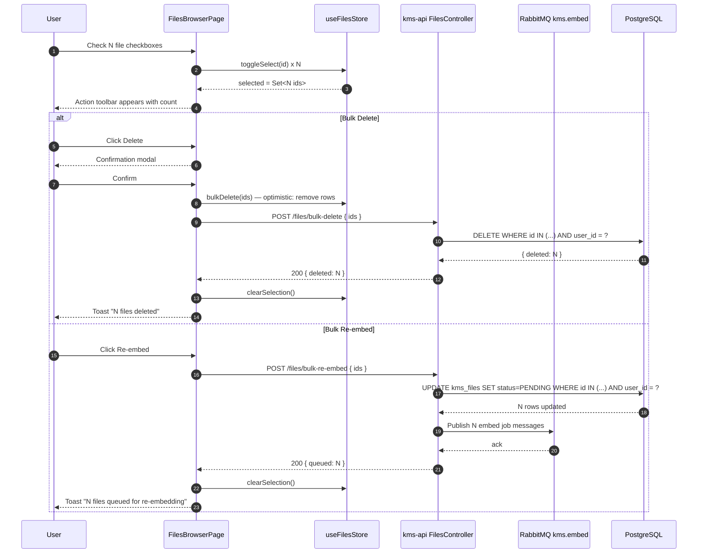

# PRD: Enhanced Files Browser — Embedding Status and Bulk Operations

## Status

`Draft`

**Created**: 2026-03-24
**Author**: Gaurav (Ved)
**Reviewer**: —

---

## Business Context

The current Files Browser (`/files`) lists files but gives no indication of whether a file has been processed by the embedding pipeline. Users have no way to know if a file is searchable, stuck, or failed. Additionally, managing files one-by-one is impractical for users who have thousands of documents: deleting or re-triggering embedding for a handful of stuck files requires repeated individual actions. This feature adds per-file embedding status visibility, bulk selection, bulk delete, and bulk re-embed triggering — giving users confidence that their knowledge base is healthy and reducing the operational burden of managing large file sets.

---

## User Stories

| As a... | I want to... | So that... |
|---------|-------------|-----------|
| User | See an embedding status badge on every file | I know at a glance whether a file is searchable yet |
| User | Quickly identify files that failed embedding | I can take action without manually searching for errors |
| User | Select multiple files at once using checkboxes | I can perform batch operations efficiently |
| User | Bulk delete a set of files | I can clean up unwanted files without clicking 100 times |
| User | Bulk re-trigger embedding for stuck or failed files | I can recover from pipeline failures without contacting support |
| User | See a clear confirmation before bulk deleting | I don't accidentally destroy files I need |
| User | See per-file actions (delete, re-embed, view metadata) in a context menu | I can manage a single file quickly without bulk mode |

---

## Scope

**In scope:**
- `embeddingStatus` field added to `GET /files` response (derived from existing `FileStatus` enum: PENDING → "pending", PROCESSING → "processing", INDEXED → "embedded", ERROR → "failed")
- Bulk delete via existing `POST /files/bulk-delete` endpoint (already implemented in `FilesController`); frontend bulk-delete flow wired to this endpoint
- New `POST /files/bulk-re-embed` endpoint — accepts array of file IDs, resets their status to PENDING, publishes embed jobs to `kms.embed` queue
- Frontend: checkbox column on files table, "select all on page" checkbox in header
- Frontend: action toolbar appears when ≥1 file is selected (shows count + Delete + Re-embed buttons)
- Frontend: embedding status badge per file row (color-coded)
- Frontend: confirmation modal before bulk delete
- Frontend: single-file context menu with Delete, Re-embed, View Metadata
- Zustand `useFilesStore` updated with `selected: Set<string>`, `toggleSelect()`, `selectAll()`, `clearSelection()`, `bulkReEmbed()`
- Optimistic UI updates on bulk delete: remove rows immediately, roll back on API error with toast

**Out of scope:**
- Real-time status updates via WebSocket or SSE (polling or manual refresh only for MVP)
- Bulk tag or bulk move operations (covered in PRD-M11-web-ui.md Sprint 4 additions)
- Embedding progress percentage per file
- Download or export of selected files

---

## Functional Requirements

| ID | Requirement | Priority | Notes |
|----|-------------|----------|-------|
| FR-01 | `GET /files` response includes `embeddingStatus` string field per file, mapped from `FileStatus` enum | Must | Mapping: PENDING→`pending`, PROCESSING→`processing`, INDEXED→`embedded`, ERROR→`failed`, UNSUPPORTED→`unsupported`, DELETED→`deleted` |
| FR-02 | Files table has a checkbox column as the first column; individual row checkboxes toggle selection | Must | |
| FR-03 | Table header has a "select all" checkbox that selects all files on the current page | Must | Indeterminate state when some (not all) are selected |
| FR-04 | When ≥1 file is selected, a sticky action toolbar appears above the table showing: selected count, Delete button, Re-embed button, Clear selection link | Must | |
| FR-05 | Clicking Delete in toolbar opens a confirmation modal: "Delete N files? This cannot be undone." with Cancel and Confirm buttons | Must | |
| FR-06 | Confirming bulk delete calls `POST /files/bulk-delete` with selected IDs; rows are removed optimistically and restored on error | Must | |
| FR-07 | `POST /files/bulk-re-embed` endpoint accepts `{ ids: string[] }` (max 100), resets file statuses to PENDING, and publishes embed job messages to `kms.embed`; returns `{ queued: number }` | Must | |
| FR-08 | Clicking Re-embed in toolbar calls `POST /files/bulk-re-embed`; shows toast "N files queued for re-embedding" on success | Must | |
| FR-09 | Each file row has a three-dot context menu with: Open (link to file detail), Re-embed (single file), Delete (single file with confirmation) | Should | |
| FR-10 | Embedding status badge uses color coding: `pending` = gray, `processing` = blue (animated pulse), `embedded` = green, `failed` = red, `unsupported` = yellow | Must | Use existing `Badge` component with appropriate variants |
| FR-11 | Failed files display a tooltip on the status badge with the last error message from `metadata.lastError` if present | Should | |
| FR-12 | Selection is cleared automatically after a successful bulk operation | Must | |
| FR-13 | `GET /files` supports new optional query param `?embeddingStatus=failed` for filtering by embedding status | Should | Maps to `status=ERROR` filter at the repository layer |
| FR-14 | Bulk delete and re-embed are limited to 100 files per request; UI disables bulk actions and shows warning if selection exceeds 100 | Must | |

---

## Non-Functional Requirements

| Concern | Requirement |
|---------|-------------|
| Performance | Bulk delete of 100 files must complete in < 3 s (p95) |
| Performance | `POST /files/bulk-re-embed` must publish all AMQP messages in < 2 s for 100 files |
| Optimistic UI | Row removal must appear < 100 ms after user confirms delete |
| Error rollback | If bulk delete API returns an error, all rows must be restored within one render cycle |
| Scalability | `embeddingStatus` field must not require an extra DB query per file — compute from existing `status` column |
| Accessibility | Checkboxes must have aria-labels; action toolbar must be keyboard accessible; confirmation modal must trap focus |

---

## Data Model Changes

No new columns are required. The `embeddingStatus` field in API responses is a derived/computed value mapped from the existing `FileStatus` column on `kms_files`.

The `bulk-re-embed` endpoint updates existing rows:

```sql
-- bulk-re-embed: reset status for selected files owned by the user
UPDATE kms_files
SET status = 'PENDING', updated_at = NOW()
WHERE id = ANY($1::uuid[])
  AND user_id = $2
  AND status IN ('ERROR', 'INDEXED');
-- Returns the count of updated rows for the response { queued: N }
```

No migration is needed; the `status` column and `FileStatus` enum already exist.

---

## API Contract

| Method | Path | Auth | Description |
|--------|------|------|-------------|
| GET | `/api/v1/files` | JWT | Existing endpoint — adds `embeddingStatus` to each file object in response |
| POST | `/api/v1/files/bulk-delete` | JWT | Existing endpoint — bulk delete up to 100 files by ID array |
| POST | `/api/v1/files/bulk-re-embed` | JWT | New endpoint — reset status to PENDING and publish embed jobs for up to 100 files |

### `POST /api/v1/files/bulk-re-embed` Request Body
```json
{
  "ids": ["uuid-1", "uuid-2"]
}
```

### `POST /api/v1/files/bulk-re-embed` Response (200)
```json
{
  "queued": 2
}
```

### Updated `GET /api/v1/files` Response Shape (per-file object)
```json
{
  "id": "uuid",
  "name": "document.pdf",
  "mimeType": "application/pdf",
  "sizeBytes": 102400,
  "status": "ERROR",
  "embeddingStatus": "failed",
  "createdAt": "2026-03-01T12:00:00Z",
  "updatedAt": "2026-03-24T09:15:00Z"
}
```

---

## Flow Diagram



---

## Decisions Required

| # | Question | Options | Decision | ADR |
|---|---------|---------|----------|-----|
| 1 | How to expose embeddingStatus — computed in service vs DB view | Compute in service from existing `status` field | Compute in service (zero migration cost) | — |
| 2 | Re-embed flow: reset to PENDING only, or also clear Qdrant vectors first | Reset to PENDING; embed-worker handles upsert | Reset to PENDING (embed-worker already handles upsert) | — |
| 3 | Optimistic update strategy for bulk delete | Immediate removal + rollback on error | Zustand snapshot + restore slice | — |

---

## ADRs Written

- [ ] [ADR-NNNN: Bulk Re-embed Flow](../architecture/decisions/NNNN-bulk-re-embed-flow.md)

---

## Sequence Diagrams Written

- [ ] [02 — Bulk delete optimistic flow](../architecture/sequence-diagrams/02-bulk-delete-optimistic.md)
- [ ] [03 — Bulk re-embed pipeline flow](../architecture/sequence-diagrams/03-bulk-re-embed-pipeline.md)

---

## Feature Guide Written

- [ ] [FOR-enhanced-files.md](../development/FOR-enhanced-files.md)

---

## Testing Plan

| Test Type | Scope | Coverage Target |
|-----------|-------|----------------|
| Unit | `FilesService.bulkReEmbed()` — happy path, user ownership filter, AMQP publish, count returned | 80% |
| Unit | `embeddingStatus` mapping function — all 6 FileStatus values map to correct string | 100% |
| Unit | `useFilesStore` — toggleSelect, selectAll, clearSelection, bulkDelete optimistic + rollback | 80% |
| Integration | `POST /files/bulk-re-embed` with valid JWT → 200 `{ queued: N }`; with file IDs belonging to another user → 200 `{ queued: 0 }` (silently ignored) | Key paths |
| Integration | `POST /files/bulk-re-embed` with 101 IDs → 400 validation error | Error branch |
| Integration | `POST /files/bulk-delete` reuses existing tests; add: confirm AMQP message is NOT published on delete | Regression |
| E2E | Select 3 files → click Re-embed → toast "3 files queued" → status badges update to "pending" | Happy path |
| E2E | Select 2 files → click Delete → confirm modal → toast "2 files deleted" → rows removed | Happy path |
| Regression | Non-owner cannot delete or re-embed another user's files via bulk endpoints | Isolation |

---

## Rollout

| Item | Value |
|------|-------|
| Feature flag | `.kms/config.json` → `features.bulkFileOperations.enabled` |
| Requires migration | No — all changes use existing schema columns |
| Requires seed data | No |
| Dependencies | M04 (Embedding Pipeline) must be running for re-embed to produce results |
| Rollback plan | Remove `bulk-re-embed` route from `FilesController`; hide action toolbar in frontend behind feature flag |

---

## Linked Resources

- Architecture: [docs/architecture/ENGINEERING_STANDARDS.md](../architecture/ENGINEERING_STANDARDS.md)
- Related PRD: [PRD-M04-embedding-pipeline.md](PRD-M04-embedding-pipeline.md)
- Related PRD: [PRD-M11-web-ui.md](PRD-M11-web-ui.md) — BulkActionBar component spec
- Controller reference: `kms-api/src/modules/files/files.controller.ts` — `bulkDeleteFiles()` (already implemented)
