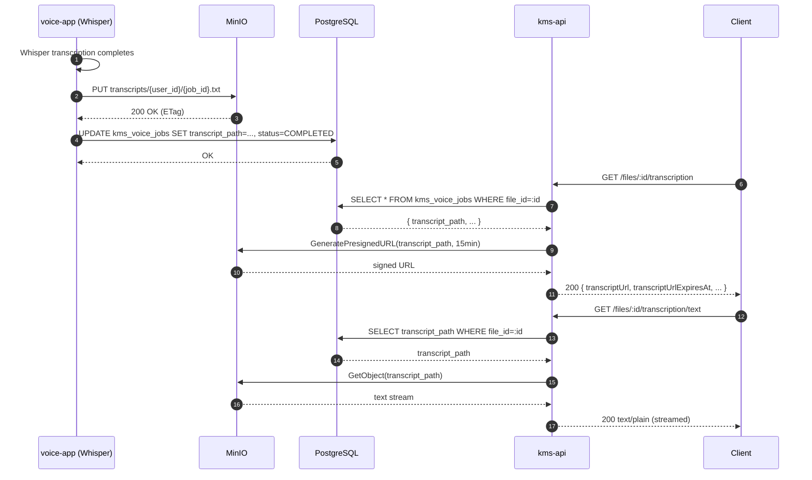

# PRD: MinIO Transcript Storage

---

## Status

`Draft`

**Created**: 2026-03-23
**Author**: Gaurav (Ved)
**Reviewer**: —

---

## Business Context

The `kms_voice_jobs.transcript` column is a PostgreSQL `TEXT` field. A single 1-hour audio transcription produces approximately 50 KB of plain text. As the user's knowledge base grows into thousands of voice files, this approach bloats the primary database, inflates backup sizes, and forces every job query to pull large payloads even when only status metadata is needed.

Moving transcript storage to MinIO (S3-compatible object storage) decouples large binary-adjacent content from the relational database, reduces PostgreSQL I/O, and enables future features such as per-transcript encryption, versioning, and streamed delivery — without changing the core data model.

---

## User Stories

| As a... | I want to... | So that... |
|---------|-------------|-----------|
| End user | Retrieve a transcript for a voice file | I can read or copy the transcribed text |
| End user | Get a direct download link to a transcript | I can open or share it without loading the full app |
| Admin | Keep PostgreSQL lean | Database backups and queries remain fast as the library grows |
| Developer | Know exactly where transcript content lives | I can debug or migrate data without scanning TEXT columns |

---

## Scope

**In scope:**
- Add MinIO service to `docker-compose.kms.yml`
- Add `transcript_path VARCHAR(512)` column to `kms_voice_jobs`
- Deprecate (keep in v1, remove in v2) `transcript TEXT` column
- voice-app: upload transcript to MinIO after Whisper completes, then update DB
- `GET /files/:id/transcription` response adds `transcriptUrl` (pre-signed, 15-min TTL)
- New endpoint `GET /files/:id/transcription/text` — fetches from MinIO and streams text
- MinIO bucket `kms-transcripts` with private policy (no public access)
- Object key convention: `transcripts/{user_id}/{job_id}.txt`

**Out of scope:**
- Client-side transcript editing or annotation
- Transcript versioning (v2 consideration)
- Per-object encryption beyond SSE-S3 (tracked in BACKLOG-security-hardening.md)
- Multi-tenant bucket isolation (single bucket with key-prefix isolation for v1)
- Automatic migration of existing transcript TEXT values to MinIO (manual migration script, not in this PRD)

---

## Functional Requirements

| ID | Requirement | Priority | Notes |
|----|-------------|----------|-------|
| FR-01 | MinIO service added to `docker-compose.kms.yml` with named volume `minio_data` | Must | Image: `minio/minio:RELEASE.2024-01-16T16-07-38Z` |
| FR-02 | Bucket `kms-transcripts` created on first start (init container or startup hook) | Must | Bucket policy: private |
| FR-03 | `kms_voice_jobs` gains `transcript_path VARCHAR(512)` column via Prisma migration | Must | Nullable; populated after upload completes |
| FR-04 | `transcript TEXT` column retained in v1 as nullable/deprecated; removed in v2 migration | Must | Backward compatibility for existing rows |
| FR-05 | voice-app uploads transcript to MinIO at `transcripts/{user_id}/{job_id}.txt` before marking job COMPLETED | Must | Upload must succeed before status update; on upload failure, job stays FAILED |
| FR-06 | `GET /files/:id/transcription` response includes `transcriptUrl` (pre-signed URL, 15-min TTL) when `transcript_path` is set | Must | Existing response fields unchanged |
| FR-07 | `GET /files/:id/transcription/text` endpoint fetches object from MinIO and streams text to client | Must | Returns 404 if `transcript_path` is null |
| FR-08 | Pre-signed URLs expire in exactly 15 minutes | Must | Not configurable in v1 |
| FR-09 | voice-app env receives `MINIO_ENDPOINT`, `MINIO_ACCESS_KEY`, `MINIO_SECRET_KEY`, `MINIO_BUCKET` | Must | Added to docker-compose and `.env.example` |
| FR-10 | Object key includes `user_id` prefix for audit trail | Should | Enables per-user lifecycle policies in future |
| FR-11 | kms-api env receives same MinIO vars for pre-signed URL generation | Must | URL signing happens server-side |

---

## Non-Functional Requirements

| Concern | Requirement |
|---------|-------------|
| Performance | Pre-signed URL generation < 50 ms (no I/O, only signing). Transcript text streaming: first byte < 500 ms for files up to 200 KB |
| Security | Bucket policy private; all access via pre-signed URLs or server-side fetch. MinIO port (9000) not exposed publicly — internal Docker network only |
| Scalability | Named volume `minio_data` sufficient for v1; can be replaced with S3-compatible cloud storage by swapping env vars |
| Availability | MinIO is a single node in v1 (no replication). Acceptable for development and early production |
| Data retention | Transcripts retained until the parent `kms_voice_job` is deleted. No TTL on objects in v1 |
| Observability | Structured log event on every upload (job_id, user_id, object_key, size_bytes). Structured log on every pre-signed URL generation |

---

## Data Model Changes

```sql
-- Migration v1: Add transcript_path, deprecate transcript
ALTER TABLE kms_voice_jobs
  ADD COLUMN transcript_path VARCHAR(512) NULL;

-- transcript TEXT column kept as nullable (existing rows unaffected)
-- No DROP in this migration

-- Migration v2 (future): Remove deprecated column
-- ALTER TABLE kms_voice_jobs DROP COLUMN transcript;
```

Object key pattern (not stored in DB schema, enforced in application code):
```
transcripts/{user_id}/{job_id}.txt
```

---

## API Contract

| Method | Path | Auth | Description |
|--------|------|------|-------------|
| GET | `/api/v1/files/:id/transcription` | JWT | Returns job metadata + `transcriptUrl` (pre-signed, 15 min TTL) |
| GET | `/api/v1/files/:id/transcription/text` | JWT | Fetches transcript from MinIO, streams plain text response |

**Response change for `GET /files/:id/transcription`:**
```json
{
  "jobId": "uuid",
  "status": "COMPLETED",
  "language": "en",
  "duration": 3612,
  "transcriptUrl": "http://minio:9000/kms-transcripts/transcripts/uid/jid.txt?X-Amz-...",
  "transcriptUrlExpiresAt": "2026-03-23T10:15:00Z"
}
```

---

## Flow Diagram



---

## Decisions Required

| # | Question | Options | Decision | ADR |
|---|---------|---------|----------|-----|
| 1 | Which MinIO SDK for voice-app (Python)? | `minio` (official), `boto3` (AWS S3-compatible) | Pending — `boto3` preferred for portability | — |
| 2 | Which MinIO SDK for kms-api (NestJS)? | `@aws-sdk/client-s3` (S3-compatible), `minio` npm package | Pending — `@aws-sdk/client-s3` preferred | — |
| 3 | Migrate existing transcript TEXT rows to MinIO? | Yes (migration script), No (leave as-is until re-processed) | Pending | — |
| 4 | Expose MinIO console port (9001) in dev? | Yes (dev only), No | Yes in dev, blocked in prod compose | — |

---

## ADRs Written

- [ ] ADR to be written: Choice of S3 SDK for voice-app (boto3 vs minio)
- [ ] ADR to be written: Choice of S3 SDK for kms-api (@aws-sdk vs minio npm)

---

## Sequence Diagrams Written

- [ ] Sequence diagram to be written: `docs/architecture/sequence-diagrams/NN-minio-transcript-upload.md`
- [ ] Sequence diagram to be written: `docs/architecture/sequence-diagrams/NN-minio-presigned-url.md`

---

## Feature Guide Written

- [ ] [FOR-minio-transcript-storage.md](../development/FOR-minio-transcript-storage.md)

---

## Testing Plan

| Test Type | Scope | Coverage Target |
|-----------|-------|----------------|
| Unit | MinIO upload helper, pre-signed URL generation, path builder | 80% |
| Integration | voice-app: upload → DB update flow; kms-api: fetch path → sign URL | Key paths |
| E2E | POST transcription job → poll COMPLETED → GET transcription → follow URL | Happy path + MinIO unavailable error case |

---

## Rollout

| Item | Value |
|------|-------|
| Feature flag | `.kms/config.json` → `features.minioTranscripts.enabled` (default `false` in dev until MinIO service confirmed healthy) |
| Requires migration | Yes — Prisma migration adds `transcript_path` column |
| Requires seed data | No |
| Dependencies | PRD-M08-transcription.md must be fully operational |
| Rollback plan | Set `features.minioTranscripts.enabled = false`; voice-app falls back to writing transcript TEXT directly to DB column |

---

## Linked Resources

- Base transcription feature: [PRD-M08-transcription.md](PRD-M08-transcription.md)
- Security hardening (SSE-S3 encryption): [BACKLOG-security-hardening.md](BACKLOG-security-hardening.md)
- Docker infra guide: `docs/guides/FOR-docker.md`
