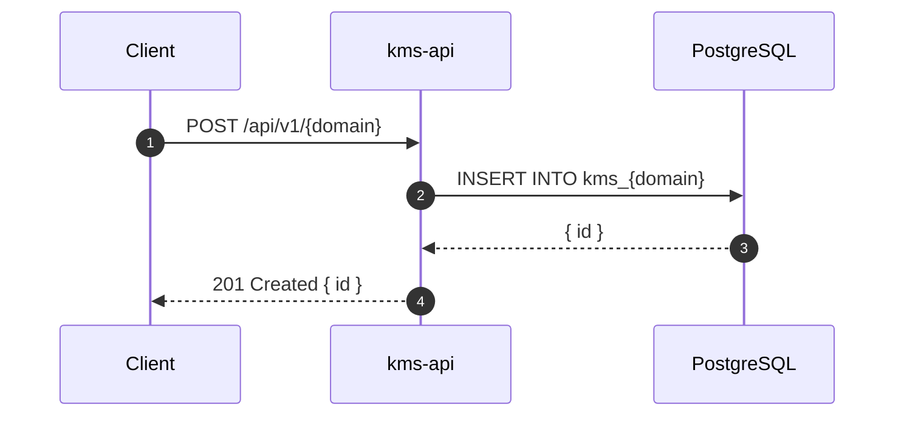

# PRD: [Feature Name]

> Copy this template to `docs/prd/PRD-{feature-name}.md` and fill it in.
> See `docs/workflow/ENGINEERING_WORKFLOW.md` for gate criteria.

---

## Status

`Draft` | `Review` | `Approved` | `In Development` | `Done`

**Created**: YYYY-MM-DD
**Author**: [Name]
**Reviewer**: [Name]

---

## Business Context

*2-4 sentences. Why does this feature exist? What user problem or business goal does it serve?
What happens today without this feature? What changes when it ships?*

---

## User Stories

| As a... | I want to... | So that... |
|---------|-------------|-----------|
| Registered user | ... | ... |
| Admin | ... | ... |

---

## Scope

**In scope:**
- ...
- ...

**Out of scope:**
- ...
- ...

---

## Functional Requirements

| ID | Requirement | Priority | Notes |
|----|-------------|----------|-------|
| FR-01 | ... | Must | ... |
| FR-02 | ... | Should | ... |
| FR-03 | ... | Could | ... |

Priority: `Must` (launch blocker) | `Should` (important, not blocking) | `Could` (nice to have)

---

## Non-Functional Requirements

| Concern | Requirement |
|---------|-------------|
| Performance | p95 response time < X ms |
| Security | ... |
| Scalability | Must handle N requests/sec |
| Availability | ... |
| Data retention | ... |

---

## Data Model Changes

*List tables or fields being added or modified. Leave blank if none.*

```sql
-- New table
CREATE TABLE kms_{domain} (
    id UUID PRIMARY KEY DEFAULT gen_random_uuid(),
    ...
);

-- Modified table: add column X to kms_files
ALTER TABLE kms_files ADD COLUMN ...;
```

---

## API Contract

*List all endpoints this feature adds or modifies. Full schema in `contracts/openapi.yaml`.*

| Method | Path | Auth | Description |
|--------|------|------|-------------|
| POST | `/api/v1/{domain}` | JWT | Create ... |
| GET | `/api/v1/{domain}/{id}` | JWT | Get ... |
| PATCH | `/api/v1/{domain}/{id}` | JWT | Update ... |
| DELETE | `/api/v1/{domain}/{id}` | JWT | Delete ... |

---

## Flow Diagram

*Happy path only. Error flows in the linked sequence diagram.*



---

## Decisions Required

*List open questions that need resolution. Each decision becomes an ADR before Gate 3 closes.*

| # | Question | Options | Decision | ADR |
|---|---------|---------|----------|-----|
| 1 | Which library for X? | A, B, C | Pending | — |
| 2 | Sync or async? | Sync, Async | Pending | — |

---

## ADRs Written

*Link ADRs once written. Required before status = Approved.*

- [ ] [ADR-NNNN: Title](../architecture/decisions/NNNN-title.md)

---

## Sequence Diagrams Written

*Link diagrams once written. Required before Gate 3 closes.*

- [ ] [NN — Flow Name](../architecture/sequence-diagrams/NN-flow-name.md)

---

## Feature Guide Written

*Link the FOR-*.md guide once written. Required before PR can merge.*

- [ ] [FOR-{feature-name}.md](../development/FOR-{feature-name}.md)

---

## Testing Plan

| Test Type | Scope | Coverage Target |
|-----------|-------|----------------|
| Unit | Service methods, business logic | 80% |
| Integration | DB operations, AMQP flows | Key paths |
| E2E | Full endpoint flow | Happy path + error cases |

---

## Rollout

| Item | Value |
|------|-------|
| Feature flag | `.kms/config.json` → `features.{featureName}.enabled` |
| Requires migration | Yes / No |
| Requires seed data | Yes / No |
| Dependencies | [Other features that must ship first] |
| Rollback plan | [How to disable if issues arise] |

---

## Linked Resources

- Architecture: [Link to relevant architecture doc]
- Previous PRD/discussion: [Link if this evolved from another discussion]
